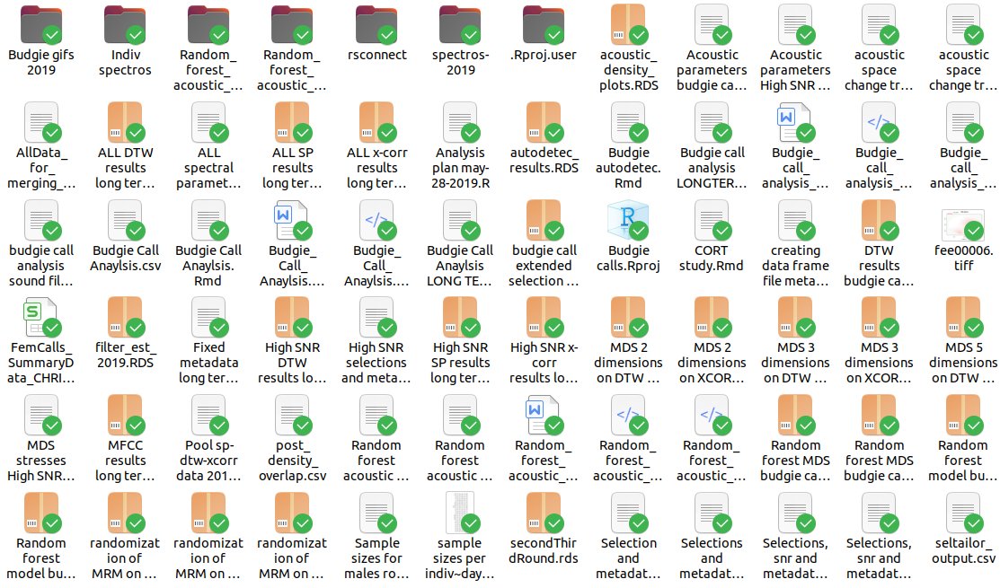
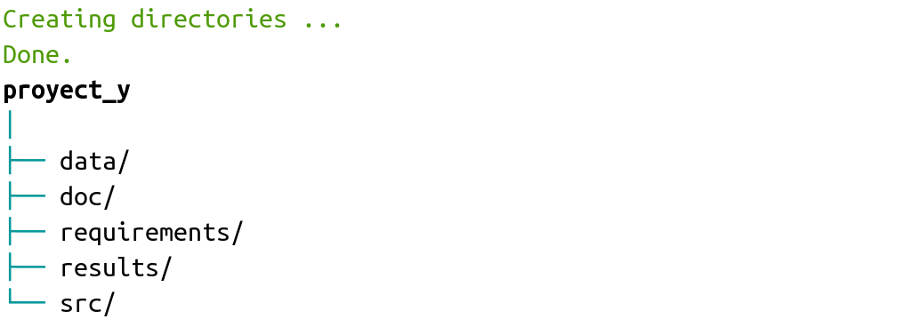

<style>
body
  { counter-reset: source-line 0; }
pre.numberSource code
  { counter-reset: none; }
</style>

&nbsp; 

```{r, echo = FALSE, warning=FALSE, message=FALSE}


library(knitr)
opts_chunk$set(warning = FALSE, message = FALSE, tidy = TRUE, fig.align = "center")

# install.packages("workflowr")
# remotes::install_github("benmarwick/rrtools")
# remotes::install_github("CrumpLab/vertical")
# remotes::install_github("crsh/papaja")
  
library(workflowr)
library(vertical)
library(rrtools)
library(papaja)
library(sketchy)

# devtools::install_github("hadley/emo")
library("emo")
library("xaringanExtra")
library("knitr")

# options to customize chunk outputs
knitr::opts_chunk$set(
  class.source = "numberLines lineAnchors", # for code line numbers
  tidy.opts = list(width.cutoff = 65), 
  tidy = TRUE,
  message = FALSE
 )

htmltools::tagList(
  xaringanExtra::use_clipboard(
    button_text = "<i class=\"fa fa-clipboard\"></i>",
    success_text = "<i class=\"fa fa-check\" style=\"color: #90BE6D\"></i>",
    error_text = "<i class=\"fa fa-times-circle\" style=\"color: #F94144\"></i>"
  ),
  rmarkdown::html_dependency_font_awesome()
)

# this is a customized printing style data frames 
# screws up tibble function
tibble <- function(x, ...) { 
  x <- kbl(x, digits=4, align= 'c', row.names = FALSE) 
   x <- kable_styling(x, position ="center", full_width = FALSE,  bootstrap_options = c("striped", "hover", "condensed", "responsive")) 
   asis_output(x)
}

registerS3method("knit_print", "data.frame", tibble)
```

&nbsp; 

A medida que los análisis de datos científicos aumentan en complejidad, también aumentan los desafíos para asegurarse que estos análisis sean reproducible. Varias propuestas han surgido para intentar solucionar los problemas de reproducibilidad en el análisis computacional de datos. 

Lastimosamente esto se complica aún mas con la falta de instrucción formal en el manejo y estructuración de datos para análisis que sufren (sufrimos) los científicos. Esto hace casi inevitable la poca consistencia y hasta el caos en nuestra organización de datos para proyectos de investigación. Este es un ejemplo de un proyecto "poco estructurado" (por usar un eufemismo):

```{r, out.width="100%", echo=FALSE}



```

&nbsp;

Esta (falta de) "estructura" no es práctica. Lastimosamente, es probable que no sea un caso aislado. 

En este tutorial hablaremos sobre algunas de las herramientas que se han desarrollado para solventar estos problemas que se han desarrollado en R. 

&nbsp;

## Formatos para la estructura de carpetas 

Aquí encontrarán una lista corta y para nada exhaustiva de ejemplos de estructura de carpetas para proyectos de análisis de datos.

&nbsp;

### Formato "Noble" 

Noble (2009) propone una estructura de datos especifica para datos bioinformáticos (aunque podría ser adaptada a otras necesidades):

```{r, out.width="100%", echo=FALSE}

knitr::include_graphics("images/noble2009.png")

```
&nbsp;

Esta estructura, sin embargo, utiliza carpetas con fechas para llevar el orden cronológico del análisis, algo que debería ser documentado con un sistema de control de versiones (i.e. Git). Por lo que resulta poco funcional.

&nbsp;

### Formato R-dir 

En [este blog](https://r-dir.com/blog/2013/11/folder-structure-for-data-analysis.html) se propone el siguiente formato:

```{r, eval = FALSE}

  analysis_r-dir/
    |
    ├── code/
    │   ├── processed       
    │   └── raw  
    ├── data/
    │   ├── raw/
    │   └── clean/
    ├── figures/            
    │   ├── exploratory       
    │   └── final  
    └── text/
        ├── final
        └── notes

```

&nbsp;

Las principales carpetas incluyen:

  * *code*: contiene todos los scripts de R (u otros lenguajes); los crudos (?) van en "./code/raw" y los procesados en "./processed/clean"
    
  * *data*: cualquier tipo de datos, los crudos van en "./data/raw" y los procesados en "./data/clean"
  
  * *figures*: las figuras exploratorias van en "./figures/exploratory" y las definitivas en "./figures/final"

Este formato puede ser copiado (o clonado) de [su repositorio de github](https://github.com/lenwood/analysis-project).

Las estructura propuesta es similar a otras que encontramos en la web. Las variaciones dependen un poco del tipo de datos y el formato de los resultado obtenidos (i.e. imágenes vs arboles filogéneticos). 

&nbsp;

### Formato "Moldach"

Este formato es muy similar al anterior, y se incluye principalmente para resaltar los factores comunes entre los diferentes formatos propuestos:

```{r, eval = FALSE}

nombre_del_proyecto
|--data
    |--raw
        |--file_001.xlsx
        |--file_002.gen
        |--file_002.sample
    |--tidy
        |--file_001-cleaned.csv
|--refs
    |--Oldach_2018.pdf
|--analysis
    |--01-analysis.Rmd
|--figures
    |--01-scatterplot.jpg
    |--01-correlation.png
|--R
    |--exploratory_analysis.R
    |--pdf_scraper.R
|--name_of_project.Rproj
|--run_all.R

```
&nbsp;

Las principales diferencias con el formato "r-dir" son el uso de una carpeta de referencias y el código para compilar el compendio en el directorio raíz. 

El formato se describe en detalle en [este blog](https://towardsdatascience.com/the-gold-standard-of-data-science-project-management-13d68c9e85d6) y puede ser clonado de su [repositorio de github](https://github.com/moldach/project-directory).

&nbsp;

<div class="alert alert-success">

## Paquetes de R como plantilla para compendios

</br>

Algunas de estas herramientas disponibles en paquetes de R utilizan la estructura de carpetas e integración continua propia de estos paquetes (Marwick et al. 2018; Vourre & Crump 2020). Uno de estos es el paquete `vertical` (Vourre & Crump 2020). Sus autores proponen varias ventajas de utilizar este formato para compartir una productos de investigación (desde guiones de experimentos hasta artículos, presentaciones y carteles):

</br>

 * Los paquetes de R tienen una estructura de archivos estandarizada y bien organizada que es útil para fines organizativos
 
 * Los investigadores a menudo desarrollan funciones personalizadas para el análisis, y ponerlas en un paquete de R facilita compartir las funciones
 
 * Los paquetes R pueden incluir datos de un proyecto de investigación y proveen una forma natural de documentar los datos utilizando los mismos esquemas para documentar funciones de R
 
 * Los paquetes de R incluyen varios documentos a través de la carpeta de viñetas, que en principio podrían incluir varios formatos para comunicar la investigación, como un manuscrito o un conjunto de diapositivas escrito en R Markdown
 
 * Los paquetes R se pueden convertir automáticamente en sitios web a través de `pkgdown`, lo que proporciona un formato atractivo para compartir materiales relacionados a la investigación

</br>

Sin embargo el uso de este formato puede generar mas problemas de los que ayuda a resolver. Aquí enumero algunas de las incongruencias:

</br>

  * Las funciones deberían usarse una vez o en un solo punto en el flujo de análisis, entonces, ¿para que compilarlas y documentarlas con tanto detalle?

  * Documentar paquetes y las funciones dentro de estos es complejo

  * DESCRIPTION duplica esfuerzo e información de README y demanda un mayor conocimiento de formato y convenciones específicas de paquetes de R 

  * Hacer datos disponibles al cargar el ambiente no provee ventajas y hace los datos menos accesibles fuera de R (i.e. no se gana nada usando `data("base_de_datos")` en vez de `read.csv("base_de_datos.csv")`)

  * Los paquetes son para compartir herramientas que se usen repetidas veces. La reproducción de un análisis de datos se da una o pocas veces

  * Los paquetes de R tienen carpetas que no tienen funcionalidad en análisis de datos ("man", "vignettes", "inst")

  * El integrar los componentes de un paquete (necesario para poder usar integración continua) requiere de otros archivos con estructuras y convenciones complejas que implican una curva de aprendizaje innecesariamente empinada
  
Para una discusión mas detallada de los problemas asociados con el uso de paquetes como plantillas les recomendamos leer [este post (McBrain 2020)](https://milesmcbain.xyz/posts/an-okay-idea).
  

</div>

&nbsp;

---

## Paquetes de R para generación de compendios

### vertical

El paquete `vertical` provee un flujo de trabajo estructurado basado en la estructura de carpetas e integración continua de los paquetes de R para crear y compartir materiales y recursos de investigación como un paquete de R (Matthew et al. 2020). El paquete se puede instalar y/o cargar desde github así (aún no está en CRAN(?)):

```{r, eval = FALSE}

# install.packages("devtools")

devtools::install_github("CrumpLab/vertical")

library(vertical)

```
&nbsp;

También necesitarán otros paquetes si desean hacer uso de funcionalidades como escribir artículos y generar presentaciones:

```{r, eval = FALSE}

# instalar papaja
devtools::install_github("crsh/papaja")
  
install.packages("tinytex")
tinytex::tlmgr_update()

# si no puede generar los articulos trate esto como ultima opcion
# update.packages(ask = FALSE, checkBuilt = TRUE)

```

&nbsp;

#### flujo de trabajo de 'vertical'

La instalación del paquete `vertical` agrega una nueva plantilla de proyecto a RStudio (RStudio debe reiniciarse después de instalar` vertical` para que reconozca la plantilla). Los usuarios pueden iniciar un nuevo proyecto "vertical" desde RStudio eligiendo la opción al crear un nuevo proyecto. Por defecto, un proyecto "vertical" se estructura de la siguiente manera:

```{r, out.width="100%", echo=FALSE}

knitr::include_graphics("images/vertical-project.png")

```

&nbsp;

El nuevo proyecto contiene un esqueleto más complejo que el de un paquete de R: 

 - Carpetas para datos sin procesar, datos y viñetas
 - Un archivo `_pkgdown.yml` para controlar los parámetros del sitio web cuando se procesa con `pkgdown`
 - Carpetas adicionales para los productos del proyecto de investigación como "experimentos", "manuscrito", "modelo", "carteles" y "diapositivas". 

De forma predeterminada, `vertical` incluye plantillas de R Markdown de otros paquetes dentro de cada carpeta para crear cada tipo de contenido. Como resultado, `vertical` sugiere usar R como una fuente de soluciones de plataforma única para la creación de productos de investigación.


#### Crear un proyecto 'vertical'

Luego de instalar `vertical` reinicie RStudio, luego siga estos pasos para iniciar un nuevo proyecto `vertical`. Cuando elija un nombre, debe ser [un nombre de un paquete de R válido](http://r-pkgs.had.co.nz/package.html#naming). Por ejemplo, el nombre debe contener letras, números o puntos (por ejemplo, mi.nombre), pero sin puntos al final. Esto significa que no hay espacios, guiones ni guiones bajos.

```{r, out.width="50%", echo=FALSE}
knitr::include_graphics("images/vertical-new.png")
```

&nbsp;


También puede crear un proyecto 'vertical' desde la consola, consulte la documentación de `vertical_project()` para más opciones. Esto carga la ventana de plantillas de proyectos de R desde la consola:

```{r, eval=FALSE}

vertical::vertical_project()

```

&nbsp;

Esta es la estructura de carpetas que genera:

```{r, eval = FALSE}

  compendio_vertical/
    |
    ├── data_raw/
    ├── manuscripts/
    │   ├── manuscript.Rmd       
    │   └── r-references.bib  
    ├── posters/            
    ├── R/            
    ├── slides/            
    └── vignettes/            

```

&nbsp;

</br>

<div class="alert alert-info">

</br>

<font size="5">Ejercicio 1</font> 

1.1 Cree compendio usando `vertical`

</br>

1.2 Modifique el archivo R markdown en './manuscripts/' y genere nuevamente el HTML

</br>

</div>

&nbsp; 

### rrtools

El objetivo de `rrtools` es "proporcionar instrucciones, plantillas y funciones para crear un compendio básico adecuado para escribir un artículos o informes reproducibles en R" (Marwick 2019). Este paquete documenta los pasos clave y proporciona funciones útiles para crear rápidamente un nuevo compendio de investigación.

`rrtools` brinda una plantilla para la escritura académica utilizando R Markdown y `bookdown`. También permite el aislamiento de su entorno computacional mediante `Docker`, el control de versiones de paquetes mediante `MRAN` y la integración continua mediante `Travis`:

```{r, eval = FALSE}

devtools::install_github("benmarwick/rrtools")

library(rrtools)

```

&nbsp;

Podemos iniciar un compendio con `rrtools` así (no lo corran si están dentro de un proyecto de Rstudio):

```{r, eval= FALSE}

rrtools::use_compendium("nombre.del.paquete")

```

&nbsp;

Deben actualizar el archivo DESCRIPTION (ubicado en el directorio del compendio) para incluir metadatos precisos. Por ejemplo, la sección 'imports'debe tener los nombres de los paquetes utilizados en los códigos en nuestro compendio (i.e. 'Imports: warbleR, baRulho, NatureSounds').

Podemos agregar una licencia al compendio de esta forma: 
```{r, eval= FALSE}

rrtools::create_compendium("nombre.del.paquete")

```

&nbsp;

Esto añade la licencia a DESCRIPTION y genera un archivo LICENCE con los detalles de la licencia. Por defecto utiliza la licencia de MIT aunque otras licencias pueden ser definidas.

A diferencia de `vertical`, `rrtools` no genera todas las carpetas básicas necesarias para un compendio. Podemos crear estas carpetas de esta forma:

```{r, eval = FALSE}

rrtools::use_analysis()

```

&nbsp;

Esto genera la carpeta "./analysis" con la siguiente estructura:


```{r, eval = FALSE}

  analysis/
    |
    ├── paper/
    │   ├── paper.Rmd       # documento para generar el articulo
    │   └── references.bib  # referencias en formato bibtex
    ├── figures/            # figuras producidas por el rmarkdown
    |
    ├── data/
    │   ├── raw_data/       # datos crudos (originales)
    │   └── derived_data/   # datos procesados
    |
    └── templates
        ├── journal-of-archaeological-science.csl # estilo de citas
        |                   
        ├── template.docx   # plantilla de articulo generado
        └── template.Rmd    # plantilla para rmd de articulo

```

&nbsp;

EL archivo README.Rmd se puede crear asi:

```{r, eval = FALSE}

rrtools::use_readme_rmd()

```

&nbsp;

EL README generado incluye una plantilla que muestra cómo citar su proyecto (debe ser editado para incluir el título y el DOI correctos).
También contiene información de la licencia, las figuras, el código y los datos de su compendio.

Esta función también agrega otros dos archivos Rmd: un código de conducta para los usuarios (CONDUCT.md) y otro con instrucciones básicas para las personas que desean contribuir a su proyecto (CONTRIBUTING.md).

Además ofrece funciones como `rrtools::use_dockerfile()` y `rrtools::use_travis()` para facilitar la integración continua. Visite [el repositorio de github del paquete](https://github.com/benmarwick/rrtools) para mas detalle.

&nbsp;

### workflowr

El paquete `workflowr` intenta ayudar a los investigadores a "organizar sus análisis de una manera que promueve la gestión eficaz del proyecto, la reproducibilidad, la colaboración y el intercambio de resultados" (Blischak et al. 2019). `workflowr` combina programación literaria (`knitr` y `rmarkdown`) y control de versiones (Git, a través de `git2r`) para generar un sitio web que contiene resultados documentados, y 'versionados'. 

A diferencia de `rrtools` y `vertical`, `workflowr` no emula la estructura de carpetas de los paquetes de R, lo cual simplifica su uso y hace mas intuitiva su estructura desde el punto de vista del investigador.

Estas son algunas de las características del paquete que se detallan en su [sitio de github](https://jdblischak.github.io/workflowr):

 - **Organizado**
   - Proporciona una plantilla de proyecto con subdirectorios organizados
   - Mezcla código y resultados con R Markdown
   - Utiliza Git para versionar tanto el código fuente como los resultados

 - **Reproducible**
   - Muestra la versión del código utilizada para crear cada resultado
   - Ejecuta cada análisis en una sesión de R aislada
   - Registra la información de la sesión de cada análisis
   - Establece la misma semilla ("seed") para la generación de números aleatorios para cada análisis
  
 - **Compartible**
   - Crea un sitio web para presentar los resultados de su investigación
   - Documenta cómo alojar su sitio web de forma gratuita a través de GitHub Pages o GitLab Pages
   - Crea vínculos a versiones anteriores de resultados

&nbsp;

El paquete lo podemos instalar así:

```{r, eval = FALSE}
install.packages("workflowr")

library(workflowr)
```

&nbsp;

Para crear un proyecto con `workflowr` primero debemos configurar git con la función `wflow_git_config()` y luego lo iniciamos con `wflow_start()`:

```{r, eval = FALSE}

# Configurar Git
wflow_git_config(user.name = "nombre completo", user.email = "correo@dominio")

# Empezar un proyecto
wflow_start("mi_compendio")
```

&nbsp;

Esta es la estructura de las carpetas en el compendio de 'workflowr':

```{r, eval = FALSE}

mi_compendio/
├── .gitignore
├── .Rprofile
├── _workflowr.yml
├── analysis/
│   ├── about.Rmd
│   ├── index.Rmd
│   ├── license.Rmd
│   └── _site.yml
├── code/
│   ├── README.md
├── data/
│   └── README.md
├── docs/
├── myproject.Rproj
├── output/
│   └── README.md
└── README.md

```
&nbsp;

Y con este código podemos compilar el sitio del compendio:

```{r, eval = FALSE}

wflow_build()
```

Este comando 'teje' todos los archivos de R Markdown en la carpeta  './analysis' y guarda los archivos HTML correspondientes en './docs'. Cada archivo se crea en su propia sesión R externa para evitar posibles conflictos entre análisis (este es el comportamiento por defecto de archivos Rmd). Ademas abre la copia local del sitio del compendio en el navegador de internet. También podemos darle un vistazo a la copia local del sitio así:

```{r, eval = FALSE}

# ver sitio del compendio
wflow_view()

```
&nbsp;

`workflowr` distingue entre los archivos R Markdown que se publican y los que no se publican. Un archivo publicado se incluye en el sitio web en línea; mientras que el archivo HTML de un archivo R Markdown no publicado solo se puede ver en la computadora local. Dado que el proyecto recién se inició, no hay archivos publicados. Para ver el estado del proyecto de `workflowr`, debemos usar `wflow_status()`:

```{r, eval = FALSE}

# revisar estado actual
wflow_status()

```
&nbsp;


Si queremos hacer los HTMLs públicos, debemos usar la función `wflow_publish()` y proveer los nombres de los R markdowns que los generan con el argumento files. Además debemos agregar un mensaje para el 'commit' que acompaña los cambios generados cuando se sincroniza con la copia remota: 

```{r, eval = FALSE}

# publicar rmds
wflow_publish(files = c("analysis/index.Rmd", "analysis/about.Rmd", "analysis/license.Rmd"), message =  "mi primer commit del compendio")

```

&nbsp;

En este punto hemos creado un sitio web con control de versiones que existe localmente. El siguiente paso es ponerlo en un repositorio en linea (i.e. GitHub o GitLab). Para subir y/o sincronizar el compendio (incluyendo el sitio web) a github usamos la función `wflow_use_github()`. El único argumento que requiere es el nombre de usuario:

```{r, eval = FALSE}

wflow_use_github("mi_compendio")


```

&nbsp;

El tutorial ["getting started"](https://jdblischak.github.io/workflowr/articles/wflow-01-getting-started.html#the-workflow) de `workflowr` provee mas detalles de cada uno de los pasos para generar compendios con este paquete. La documentación es bastante completa, incluyendo varios otros tutoriales para personalizar los compendios y sus sitios web. [Aquí podemos encontrar la lista de tutoriales](https://jdblischak.github.io/workflowr/articles/index.html.

</br>

<div class="alert alert-info">

<font size="5">Ejercicio 2</font> 

</br>

2.1 Cree un compendio usando `workflowr`

</br>

2.2 Cree el sitio del compendio

</br>

</div>


&nbsp;

### sketchy

Este es un paquete que estamos desarollando recientemente. Por el momento solo permite crear la estructura de carpetas y generar un Rmarkdown para escribir el artículo. Tambien permite visualizar la estructura del compendio en la consola. La principal diferencia con los otros paquetes es que no se casa con una sola estructura; provee varias estructuras alternativas y también permite al usuario generar sus propios formatos.

Para usarlo debemos primero instalarlo desde [github](github.com/) así:


```{r, eval = FALSE}

# From github
devtools::install_github("maRce10/sketchy")

#load package
library(sketchy)

```


El paquete viene con 13 estructuras de carpetas.Se pueden usar con la función `compendium_skeleton()`. La función crea las carpetas/subcarpetas e imprime un diagrama del compendio en la consola:

### Compendio básico

```{r, eval = FALSE}

path = tempdir()

make_compendium(name = "proyect_x", path = path, format = compendiums$basic$skeleton)

```

```{r echo=FALSE, out.width='55%', fig.align='left'}
knitr::include_graphics('./images/compendium_1.png')
```

&nbsp; 

(*en el ejemplo se usa un directorio temporal pero este debe ser cambiado al directorio donde se quiere crear el compendio*)


### Formatos alternativos

Podemos usar formatos de otras fuentes. En este caso usamos el de Wilson *et al.* (2017):

```{r, eval = FALSE}

make_compendium(name = "proyect_y", path = path, format = compendiums$wilson$skeleton)

```

```{r echo=FALSE, out.width='55%', fig.align='left'}

```

&nbsp; 

También podemos añadir comentarios para explicar los contenidos de cada carpeta: 

```{r, eval = FALSE}

make_compendium(name = "proyect_z", path = path, format = compendiums$large_compendium$skeleton, 
    comments = compendiums$large_compendium$comments)

```

```{r echo=FALSE, out.width='55%', fig.align='left'}
knitr::include_graphics('./images/compendium_3.png')
```

&nbsp; 

Cuando se crea un compendio que incluye una carpeta llamada "manuscript" el paquete añade automáticamente el archivo "manuscript_template.Rmd" que puede ser usado para escribir el artículo del proyecto.

La idea es incluir funciones para identificar archivos grandes que no pueden ser subidos a [github](www.github.com/) y poder subirlos a otros repositorios (i.e. figshare o zenodo).


</br>

<div class="alert alert-info">

<font size="5">Ejercicio 3</font> 

</br>

3.1 Cree un compendio con una estructura personalizada usando `sketchy`

</br>

3.2 Añada comentarios a cada carpeta

</br>

</div>


&nbsp;


---

## Referencias

 - Araya-Salas, M., Willink, B., Arriaga, A. (2020), *sketchy: research compendiums for data analysis in R*. R package version 1.0.0.
 - Aust, F. & Barth, M. (2020). papaja: Prepare reproducible APA journal articles with R Markdown. R package version 0.1.0.9997. https://github.com/crsh/papaja
 - Blischak JD, Carbonetto P and Stephens M. Creating and sharing reproducible research code the workflowr way [version 1; peer review: 3 approved]. F1000Research 2019, 8:1749. (https://doi.org/10.12688/f1000research.20843.1)
 - McBain (2020). Before I Sleep: Project as an R package: An okay idea. [https://milesmcbain.com/posts/an-okay-idea/](https://milesmcbain.com/posts/an-okay-idea/)
 - Ben Marwick (2019). rrtools: Creates a Reproducible Research Compendium. R package version 0.1.0. https://github.com/benmarwick/rrtools
 - Noble WS (2009) A Quick Guide to Organizing Computational Biology Projects. PLoS Comput Biol 5(7): e1000424. https://doi.org/10.1371/journal.pcbi.1000424
 - Marwick, B., Boettiger, C., & Mullen, L. (2018). Packaging Data Analytical Work Reproducibly Using R (and Friends). American Statistician, 72(1), 80–88.
 - Matthew J. C. Crump and Matti Vuorre (2020). vertical: Reproducible worfklow for psychological science research asset creation and communication. R package version 0.1.0.0000. https://github.com/CrumpLab/vertical
 - Vuorre, M., & Crump, M. J. C. (2020). Sharing and organizing research products as R packages. Behavior Research Methods, 1–11. 
 - Wilson G, Bryan J, Cranston K, Kitzes J, Nederbragt L, et al. (2017) Good enough practices in scientific computing. PLOS Computational Biology 13(6): e1005510.
 
---

<font size="4">Session information</font>

```{r session info, echo=F}

sessionInfo()

```


