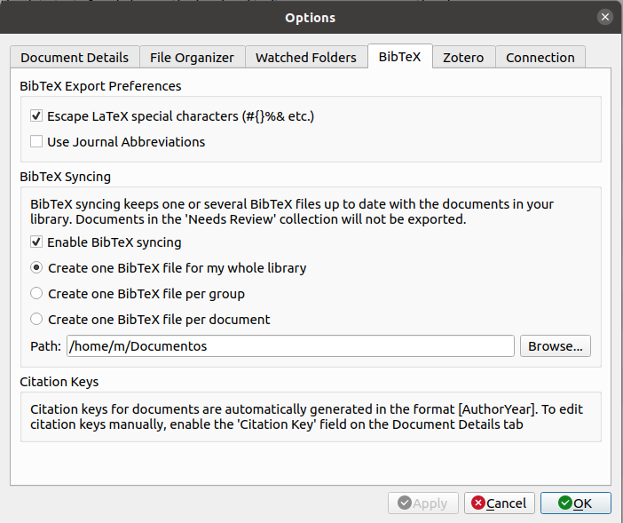
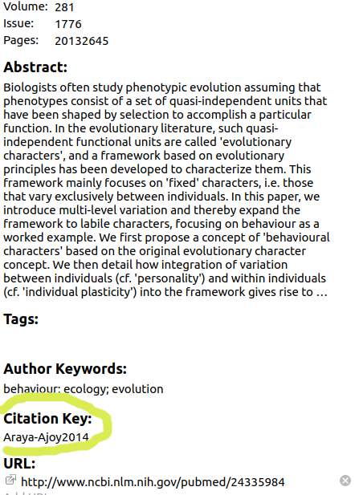

<style>
body
  { counter-reset: source-line 0; }
pre.numberSource code
  { counter-reset: none; }
</style>

&nbsp; 

```{r, echo = FALSE}

# devtools::install_github("hadley/emo")
library("emo")
library("xaringanExtra")
library("knitr")

# options to customize chunk outputs
knitr::opts_chunk$set(
  class.source = "numberLines lineAnchors", # for code line numbers
  tidy.opts = list(width.cutoff = 65), 
  tidy = TRUE,
  message = FALSE
 )

htmltools::tagList(
  xaringanExtra::use_clipboard(
    button_text = "<i class=\"fa fa-clipboard\"></i>",
    success_text = "<i class=\"fa fa-check\" style=\"color: #90BE6D\"></i>",
    error_text = "<i class=\"fa fa-times-circle\" style=\"color: #F94144\"></i>"
  ),
  rmarkdown::html_dependency_font_awesome()
)

# this is a customized printing style data frames 
# screws up tibble function
tibble <- function(x, ...) { 
  x <- kbl(x, digits=4, align= 'c', row.names = FALSE) 
   x <- kable_styling(x, position ="center", full_width = FALSE,  bootstrap_options = c("striped", "hover", "condensed", "responsive")) 
   asis_output(x)
}

registerS3method("knit_print", "data.frame", tibble)
```


```{r setting functions and parameters, echo=FALSE, message=FALSE}

options("digits"=5)
options("digits.secs"=3)
 
library(knitr)
library(kableExtra)

options(knitr.table.format = "html") 

x <- c("RColorBrewer", "ggplot2")

aa <- lapply(x, function(y) {
  if(!y %in% installed.packages()[,"Package"])  {if(y != "warbleR") install.packages(y) else devtools::install_github("maRce10/warbleR")
}
try(require(y, character.only = T), silent = T)
  })

```
 

## Bibliografías

Pandoc (el convertor de archivos Rmd -> html) puede generar automáticamente citas y una bibliografía en varios estilos. Para utilizar esta función, deberán especificar un archivo de bibliografía utilizando el campo de metadatos de bibliografía en una sección de metadatos YAML. Por ejemplo:


```{r, eval = F}

    ---
    title: "Citas en Rmarkdown"
    output: html_document
    bibliography: bibliografia.bib
    ---

```

&nbsp;

En este ejemplo el archivo que contiene las citas se llama "library.bib". Este archivo **debe estar en el mismo directorio que el archivo Rmd**. Noten que cuando añaden nuevas citas a Mendeley, necesitarán volver a copiar el archivo .bib. Hacer esto para cada nueva cita puede ser tedioso. Un truco de R para simplifiar esto es poner un código al inicio del Rmd (luego del YAML) para actualizar la copia del archivo .bib cada vez que se teje el html (o pdf):

```{r, echo = FALSE, eval = FALSE}


# update bibtex library
if(!file.copy(from = "/home/m/Documentos/library.bib", to = file.path(getwd(), "library.bib"), overwrite = TRUE))  file.copy(from = "/home/m/Documents/library.bib", to = file.path(getwd(), "library.bib"), overwrite = TRUE)


```

&nbsp;

    

La bibiolgrafia puede tomar cualquiera de estos formatos:  

```{r, echo = FALSE}

cits <- c("CSL-JSON", ".json", "MODS", ".mods", "BibLaTeX", ".bib", "BibTeX", ".bibtex", "RIS", ".ris", "EndNote", ".enl", "EndNote XML", ".xml", "ISI", ".wos", "MEDLINE", ".medline","Copac", ".copac")


cits_mat <- matrix(cits, ncol = 2, byrow = TRUE)

colnames(cits_mat) <- c("Formato", "Extensión")

kbl <- knitr::kable(cits_mat, row.names = F, escape = FALSE) 

kable_styling(kbl, bootstrap_options = c("striped", "hover", "condensed", "responsive"), full_width = FALSE, font_size = 18)

```

&nbsp;

Estos archivos pueden obtenerse de los programas para manejo de citas. Por ejemplo, en [Mendeley](mendeley.com/) podemos guardar un archivo .bib yendo a "Tools > Options > BibTex". Esto les mostrará el siguiente menú:

<p style = "text-align: center;">  </p>

&nbsp;

Allí puede escoger si quieren guardar una sola base de datos o una para cada "grupo" (carpetas en Mendeley). Una vez exportado deben ir al sitio donde se ha guardado el archivo .bib (en este ejemplo "/home/m/Documents/") y copiarlo en la carpeta del Rmd. 

&nbsp;

<div class="alert alert-info">

<font size="5">Ejercicio 1</font> 

</br>

Genere un archivo con citas usando su programa favorito de manejo de bibliografía. 

</br>

</div>

&nbsp;

## Sintaxis de las citas

Las citas van entre corchetes y están separadas por punto y coma. Dentro de los corchetes se debe poner la "clave" de la cita antecedida de un '@': 

```{r, eval = F}

      Bla bla [@Araya-Ajoy2014]

```

&nbsp;

> "Bla bla [@Araya-Ajoy2014]"


La clave es generada por el programa de manejo de bibliografía. En [Mendeley](mendeley.com/) lo podemos encontrar en el menú de "detalles" de cada cita:


<p style = "text-align: center;">  </p>

&nbsp;

Podemos añadir prefijos y sufijos de esta forma:

```{r, eval = F}

      Bla bla [ver @Araya-Ajoy2014 pp 9]

```

&nbsp;

> "Bla bla [ver @Araya-Ajoy2014 pp 9]"

&nbsp;


Dentro de los corchetes pueden incluirse varias citas. Estas deben ser separadas por punto y coma:

```{r, eval = F}

Bla bla [@Araya-Ajoy2014; @Chaverri2013]

```

&nbsp;

> "Bla bla [@Araya-Ajoy2014; @Chaverri2013]"

Podemos excluir los autores en caso de que estos esten citados en el texto añandiendo un '-' antes del '@':

```{r, eval = F}

Chaverri et al. proponen que bla bla [-@Chaverri2013]

```

&nbsp;

> "Chaverri et al. proponen que bla bla [-@Chaverri2013]"

&nbsp;

También lo podemos hacer de la siguiente forma:

```{r, eval = F}

@Chaverri2013 proponen que bla bla ...

@Chaverri2013 [pp 3] propone nque bla bla ...

```

&nbsp;

> "@Chaverri2013 propone que bla bla ..." 

> "@Chaverri2013 [pp 3] propone que bla bla ..."

&nbsp;

Las referencias que no son citadas en el texto se pueden añadir a los metadatos YAML de esta forma:

```{r, eval = FALSE}

  ---
  title: "Citas en Rmarkdown"
  output: html_document
  bibliography: bibliografia.bib
  nocite: | 
    @Vargas-Castro2015, @Eberhard2009
  ---

```

&nbsp;

Estas referencias estarán incluidas en la bibliografía (ver abajo al final del tutorial).

&nbsp;


## Generación de la sección de referencias

Las bibliografías se colocarán al final del documento. Lo normal es terminar el documento con un encabezado apropiado:

```{r, eval = FALSE}

      último párrafo...
      
      # Referencias

```


&nbsp;

<div class="alert alert-info">

<font size="5">Ejercicio 2</font> 

</br>

2.1 Incluya un parráfo con 2 citas en un solo corchete

</br>

2.2 Añada dos referencias no citadas en el texto
  
</br>

2.3 Excluya los autores de una cita 

</br>

</div>


## Estilos de referencias

De forma predeterminada, pandoc utiliza el formato de fecha-autor de Chicago para citas y referencias. Para usar otro estilo, se debe especificar un archivo de estilo CSL 1.0 en el campo de metadatos csl. Por ejemplo:


```{r, eval = F}

    ---
    title: "Citas en Rmarkdown"
    output: html_document
    bibliography: bibliografia.bib
    csl: sysbio.csl
    ---

```

&nbsp;

Estos archivos deben ser guardados en la misma carpeta del Rmd. En estos sitios se pueden encontrar archivos CSL con el formato de citas de una gran variedad de revistas:

 - https://github.com/citation-style-language/styles
  
 - https://www.zotero.org/styles


## Herramientas adicionales


Rmarkdown nos brinda algunas herramientas de formato de texto que pueden ser explotadas para llevar a cabo tareas comunes en la escritura de artículos:

 - Si a un párrafo le añadimos doble indentación (tecla "tab") este parecera como un recuadro en el html (o pdf)

 - El texto tambien puede ser exluido totalmente del arhivo de salida usando "\<!--" al inicio de cada linea que se desea excluir (lo podemos hacer con "Cntrl + Shift + C"):  

```{r, eval  = FALSE}

<!-- Este texto estará en el Rmd pero no en el html

```

Obviamente, la escritura de árticulos en Rmd se puede complementar con otras herramientas vistas anteriormente en el curso (por ejemplo en la [introducción a Rmarkdown](https://mv2.mediacionvirtual.ucr.ac.cr/mod/resource/view.php?id=761819)), como por ejemplo incluir gráficos, poner valores descriptivos y de resultados de pruebas estádisticas directamente desde el código ('codigo en texto'), inlcuir tablas, etc.


&nbsp;

<div class="alert alert-info">

<font size="5">Ejercicio 3</font> 

</br>

3.1 Busque el archivo CSL para el estilo de referencias de "Current Biology" 

</br>

3.2 Implemente el estilo de referencias de "Current Biology" en su Rmd

</br>

3.3 Añada un párrafo donde describa el promedio para el largo del pétalo y el largo del sépalo (en el juego de datos 'iris') y la correlación entre estas para la especie setosa

</br>

3.3 Añada un gráfico de dispersión que ilustre la correlación entre las variables. Incluya una leyenda para el gráfico (use la opción del chunk "fig.cap")

</br>

</div>


```{r, fig.cap="Fig. 1. Relacion entre ....", include = FALSE}

plot(iris$Sepal.Length, iris$Sepal.Width)

```


--- 

## Referencias


