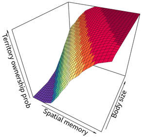
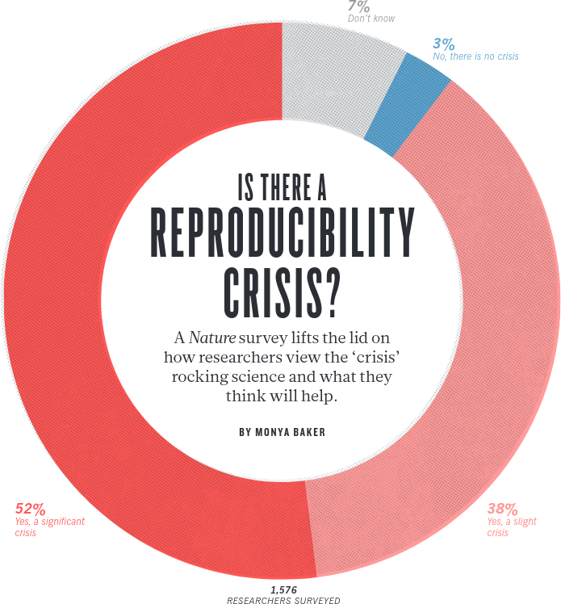
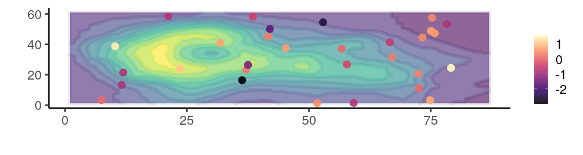
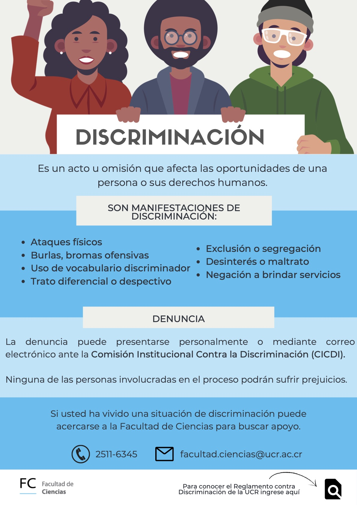
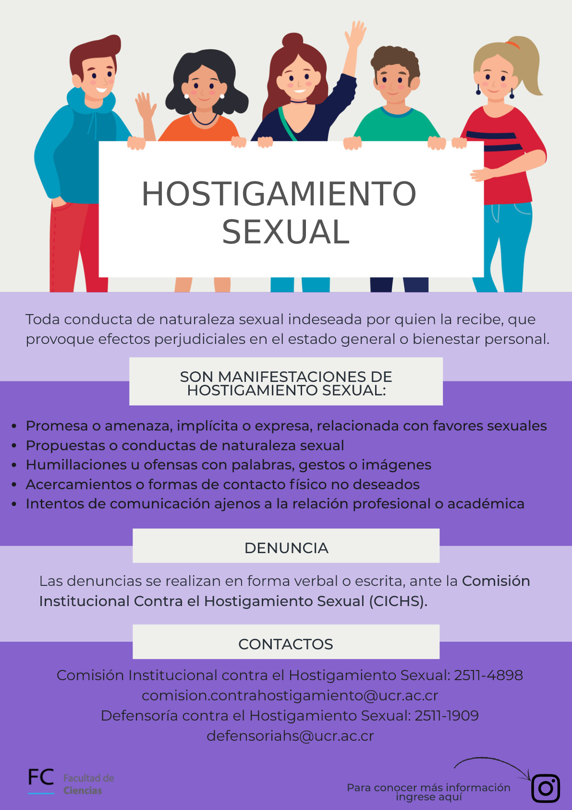

<center>
<font size="6"><b>Herramientas prácticas para investigación reproducible</b></font>
</center>

<center><font size="5"><b><a href="https://www.ucr.ac.cr/">Universidad de Costa Rica</a><br></b></font></center>

<i><center><font size="4.5"><b><a href="marceloarayasalas.weebly.com/">Marcelo Araya-Salas PhD</a><br></b></font></center></i>

<!-- <center></center> -->

```{r, out.width = "60%", echo = FALSE, fig.align= "center"}


# 

```
<i><center><font size="3"><b><a href="https://www.nature.com/articles/533452a">Baker, M. 1,500 scientists lift the lid on reproducibility. Nature 533, 452–454 (2016). </a><br></b></font></center></i>


&nbsp; 

La producción científica sufre actualmente de una falta de reproducibilidad (la capacidad de recrear un estudio con base en la información publicada), producto de la escasa documentación de los métodos y análisis utilizados, así como de la falta de acceso a los datos generados. La biología no ha escapado de esta crisis de reproducibilidad científica, que afecta la credibilidad de nuestra comunidad. Por suerte, en respuesta a esta crisis se ha desarrollado una multitud de herramientas, en la mayoría de los casos libremente disponibles, para aumentar la transparencia y accesibilidad de datos que respaldan las conclusiones de los estudios científicos. El poder hacer llegar estas herramientas a la comunidad científica y fomentar su uso de forma temprana en la formación de los investigadores resulta fundamental para solventar la crisis de reproducibilidad. Estas herramientas giran alrededor de **tres ejes principales: 1) repositorios en linea para compartir datos y productos de la investigación, 2)
herramientas digitales de libre acceso y 3) la implementación de buenas pŕacticas de manejo y análisis
de datos**. Estos tres ejes representan los módulos en que se organiza el curso. Este curso pretende
profundizar en el uso de herramientas (en su mayoría digitales) así como de buenas prácticas a lo largo
de cada uno de las etapas comunes al desarrollo de proyectos de investigación en biología.

&nbsp;

<div class="alert alert-info">

### **Objetivos**

&nbsp;

- Dar a conocer la problemática actual sobre reproducibilidad científica y sus implicaciones para la
producción de conocimiento y la legitimidad de este en la sociedad
- Brindar a los estudiantes herramientas computacionales de software libre que faciliten la documentación y accesibilidad de la investigación
- Identificar procesos en las diferentes etapas de la investigación científica en las que se pueden adoptar prácticas que facilitan la reproducibilidad
- Proveer a los estudiantes con experiencia en la aplicación de las herramientas brindadas por medio de prácticas y proyectos individuales

</div>

&nbsp;    


### **Dinámica de las clases**

- Pueden hacer preguntas en cualquier momento
- Sientanse libres de responder preguntas de compañeros
- Traten siempre de correr el código (cuando se esté usando R) y de tratar de entender todos sus elementos

&nbsp; 

<div class="alert alert-warning">


**Consejos para garantizar el máximo aprovechamiento del curso**

&nbsp; 

  - Asegurate de tener todo lo que necesitas antes del comienzo de la clase
  - Tratá de estar preparado unos minutos antes del comienzo de la clase
  - Intentá concentrarte al máximo en el curso, cerrá otros programas o pestañas innecesarias del navegador de internet (por ejemplo, instagram, twitter, etc)
  - Comentá el código


</div>

&nbsp; 

```{r, out.width = "90%", echo = FALSE, fig.align= "center"}

```

&nbsp; 

```{r, out.width = "90%", echo = FALSE, fig.align= "center"}


```