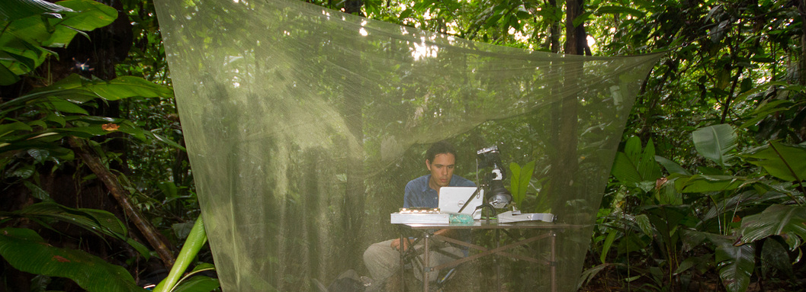

&nbsp; 

Un ecólogo del comportamiento mas que acabó haciendo mucha programación solo para poder hacer bien el análisis de datos. Así que ahora estoy bien involucrado en el desarrollo de herramientas computacionales para el análisis de datos biológicos (no genéticos), principalmente relacionados con el comportamiento animal y la bioacústica. Soy el desarrollador de los paquetes de R [warbleR](https://marce10.github.io/warbleR/index.html) y [Rraven](https://marce10.github.io/Rraven/index.html) los cuales tienen funciones para agilizar el análisis acústico de  sonidos de los animales, con el objetivo principal de simplificar el uso de R para la investigación bioacústica. Más recientemente, he publicado los paquetes de R [baRulho](https://marce10.github.io/baRulho/index.html), para cuantificar la transmisión y la degradación de la señal acústica, [ohun](https://marce10.github.io/ohun/index.html), para optimizar la detección automática y [PhenotypeSpace](https://marce10.github.io/PhenotypeSpace/index.html) para cuantificar los espacios de rasgos multidimensionales. Recientemente también desarrollé el paquete [sketchy](https://marce10.github.io/sketchy/index.html) para organizar compendios de investigación. Las nuevas funciones, así como otros análisis más elaborados, se detallan en mi blog [Bioacoustics in R](https://marce10.github.io/).
