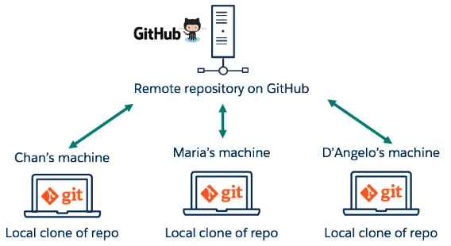
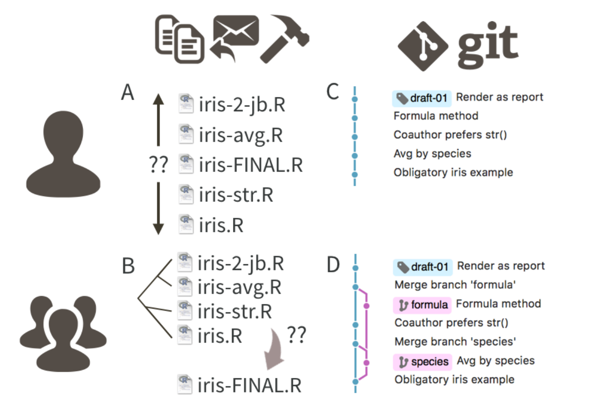
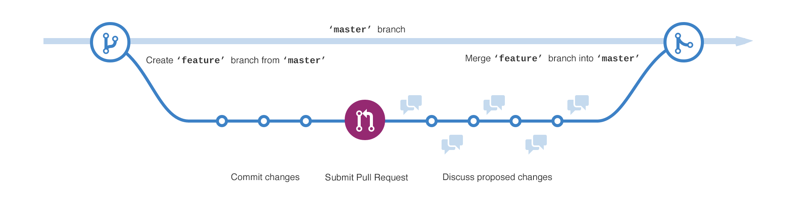
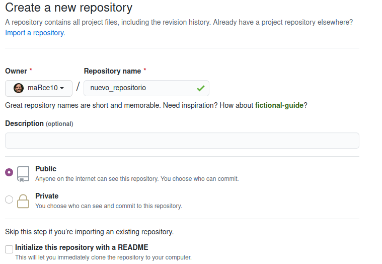
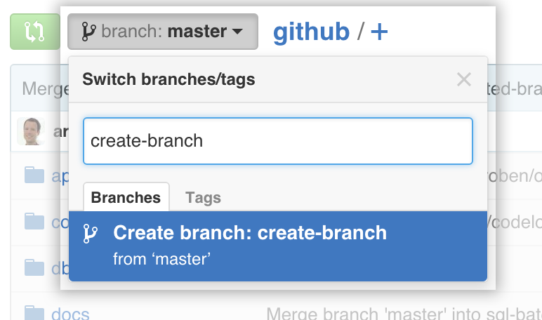
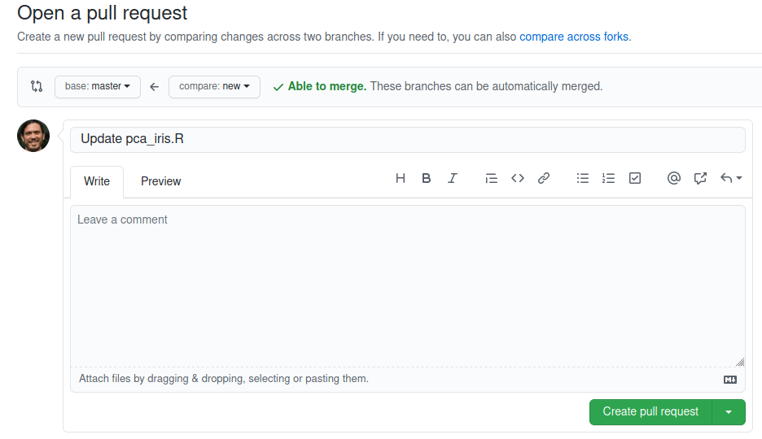
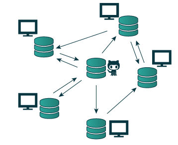

<style>
body
  { counter-reset: source-line 0; }
pre.numberSource code
  { counter-reset: none; }
</style>

&nbsp; 

```{r, echo = FALSE}

# devtools::install_github("hadley/emo")
library("emo")
library("xaringanExtra")
library("knitr")

# options to customize chunk outputs
knitr::opts_chunk$set(
  class.source = "numberLines lineAnchors", # for code line numbers
  tidy.opts = list(width.cutoff = 65), 
  tidy = TRUE,
  message = FALSE
 )

htmltools::tagList(
  xaringanExtra::use_clipboard(
    button_text = "<i class=\"fa fa-clipboard\"></i>",
    success_text = "<i class=\"fa fa-check\" style=\"color: #90BE6D\"></i>",
    error_text = "<i class=\"fa fa-times-circle\" style=\"color: #F94144\"></i>"
  ),
  rmarkdown::html_dependency_font_awesome()
)

# this is a customized printing style data frames 
# screws up tibble function
tibble <- function(x, ...) { 
  x <- kbl(x, digits=4, align= 'c', row.names = FALSE) 
   x <- kable_styling(x, position ="center", full_width = FALSE,  bootstrap_options = c("striped", "hover", "condensed", "responsive")) 
   asis_output(x)
}

registerS3method("knit_print", "data.frame", tibble)
```


## Git y Github

Git y [GitHub](github.com) son herramientas diferentes pero complementarias para el desarrollo de proyectos de programación o afines. Git es una herramienta computacional de control de versiones que es usada prácticamente por todo el mundo. [GitHub](github.com) puede ser descrito como la plataforma en linea para alojar proyectos de programación (i.e. código) mas popular. Sin embargo, esta definición es simplista: [Github](github.com) ofrece muchísimas otras herramientas para facilitar la colaboración y publicación de proyectos relacionados con la programación. 

- Git &#8594; control de versiones
- Github &#8594;repositorio en linea

<center></center>

----

&nbsp;

## Git: Control de versiones

Un sistema de control de versiones **rastrea el historial de cambios** a medida que las personas y los equipos colaboran en proyectos juntos. A medida que el proyecto evoluciona los equipos pueden ejecutar pruebas, corregir errores y aportar código nuevo con la confianza de que cualquier versión se puede recuperar en cualquier momento. 

<center></center>

<p style="font-size:11px">Tomado de Bryan 2018</p>

El control de versiones:

- Mantiene registro de los cambio realizados
- Facilita trabajo colaborativo
- Permite saber quien cambió que y cuando
- Permite revertir cambios

Git no necesita una conexión permanente a un repositorio central y permite el trabajo asincrónico de los colaboradores. 

&nbsp;

### Como instalar git

---

#### Instalar Git en Linux

Git se desarrolló originalmente en el sistema operativo Linux. Por lo tanto, tiene sentido que sea mas fácil de configurar para ejecutarse en Linux. Puede instalar Git en Linux a través de la herramienta de administración de paquetes que viene con su distribución:

- Los paquetes de Git están disponibles usando `apt`
- Es una buena idea asegurarse de que está ejecutando la última versión. Para hacerlo, navegue hasta la terminal del símbolo del sistema y ejecute el siguiente comando para asegurarse de que todo esté actualizado: `sudo apt update`
- Para instalar Git, ejecute el siguiente comando: `sudo apt install git-all`
- Una vez que se haya completado la salida del comando, puede verificar la instalación escribiendo: `git version`

---- 

#### Instalar Git en windows

  - Encuentre el último instalador de [Git para Windows](https://gitforwindows.org/) y descargue la última versión
  - Una vez que se haya iniciado el instalador, siga las instrucciones que se proporcionan en la pantalla del asistente de configuración de Git hasta que se complete la instalación
  - Abra la terminal de windows o Git Bash
  - Escriba la versión de git para verificar que se instaló Git (`git version`)

<div class="alert alert-warning">
_Nota: git-scm es recomendado para descargar Git para windows. La ventaja de descargar Git desde git-scm es que usa la última versión de Git e incluye Git Bash._
</div>

---

#### Instalar Git en mac

La mayoría de las versiones de macOS tienen Git instalado. Sin embargo, si no tiene Git instalado, se puede instalar la última versión de Git utilizando uno de estos métodos:

##### Instalar Git desde un instalador

  - Corra `git --version` en la terminal, sin aun no está instalado se le brindará la opción de instalarlo
  - Una vez que el instalador haya comenzado, siga las instrucciones que se proporcionan hasta que se complete la instalación

##### Instalar Git desde Homebrew

Homebrew es un administrador de paquetes para macOS. Si ya tiene Homebrew instalado, puede seguir los pasos para instalar Git:

  - Abra una ventana de terminal e instale Git usando el siguiente comando: `brew install git`
  - Una vez que se haya completado la salida del comando, puede verificar la instalación escribiendo: `git --version`

--- 

&nbsp;

### Usando Git para control de versiones

Git se usa típicamente desde una terminal (consola donde se corre código). En windows se recomienda usar la consola de gitbash. En los sistemas operativos basados en Unix (macOS y Linux) se puede usar directamente desde la terminal por defecto.

&nbsp;

#### Pasos 

1. **Configura tu identidad de Git**

Git usa un nombre y una dirección de correo electrónico para identificar las confirmaciones ('commits') con un autor (i.e. rastrea qué persona está realizando qué cambios). Su identidad de Git no es la misma que su cuenta de [GitHub](github.com) (pronto abajo hablaremos de [GitHub](github.com)), aunque ambas deben usar la misma dirección de correo electrónico. Por lo general, solo necesita configurar su identidad de Git una vez por computadora.

Así se puede definir su nombre de usuario en Git:

```{r, eval = FALSE}

# definir nombre en git
git config --global user.name "Su nombre"

```

... y así se puede definir el correo electrónico:

```{r, eval = FALSE}

# definir correo elec. en git
git config --global user.email "su@email.com"

```

&nbsp;

2. **Crear un repositorio local**

"Dirijase" a la carpeta donde quiere mantener el repositorio (`cd`) e inicie el repositorio local (`git init`):
  ¨
```{r, eval = FALSE}
# ejemplo de carpeta
cd /directorio/para/mi/repositorio

# iniciar repositorio local
git init

```
  
`git init` inicia un nuevo repositorio de Git y comienza a rastrear un directorio existente. Agrega una sub-carpeta oculta dentro del directorio existente que alberga la estructura de datos interna necesaria para el control de versiones.

&nbsp;

3. **Añadir un nuevo archivo**

Cree un nuevo archivo. Puede ser un archivo de .R o un archivo README.md que describa el nuevo repositorio (en este caso es solo un ejemplo). Ahora podemos usar `git status` para verificar el estado actual del proyecto: 
  
```{r, eval = FALSE}

# verificar estado
git status

```
  
<div class="alert alert-warning">
_Nota: Git puede registrar cambios específicos dentro de un archivo cuando estos son archivos de texto (archivos no-binarios). Para archivos binarios solo el historial de versiones será rastreado._
</div>

&nbsp;

4. **Confirma cambios en Git**

Para comenzar a rastrear un nuevo archivo se debe usar el siguiente comando:

```{r, eval = FALSE}

# empezar a rastrear un archivo
git add nombre.de.archivo

```

&nbsp;

Tambien podemos hacerlo para todos los nuevos archivos así:

```{r, eval = FALSE}

# empezar a rastrear todos lo nuevos archivos
git add .

```

&nbsp;

Cuando se ha empezado a rastrear un(os) archivo(s) se puede(n) confirmar los cambios en el historial de versiones del proyecto:

```{r, eval = FALSE}

# confirmar cambios
git commit -m "mensaje corto pero explicativo aqui"

```

&nbsp;

<div class="alert alert-warning">
_Un flujo de trabajo común es editar archivos en su proyecto, agregar los archivos que desea guardar usando el comando `git add` y luego tomar cofirmar los cambios del archivo usando el comando `git commit`. Tambien podemos usar `git status` para verificar el estado del proyecto._
</div>

5. **Añadir ramas**

- Una forma limpia de hacer cambios es mantenerlos en un linea de desarrollo paralela mejor conocida como "rama" ("branch")
- Tambien es la forma mas segura de trabajar en diferentes versiones de un repositorio a la vez
- De forma predeterminada el repositorio tiene una rama principal que se considera la rama con la version mas 
- Usamos ramas para experimentar y hacer ediciones antes de enviarlas a la rama principal
- Las ramas pueden mantener versiones independientes del proyecto que luego pueden (o no) unirse a la rama principal

<center></center>

&nbsp;


El siguiente código crea una nueva rama y la activa:

```{r, eval = FALSE}

# añadir una rama
git checkout -b nueva_rama

```

&nbsp;

Ahora podemos hacer cambios en el proyecto sin afectar la rama principal. Una vez que se esta conforme con los cambios estos se pueden reintegrar a la rama principal:

```{r, eval = FALSE}

# volver a la rama principal
 git checkout master

# integrar nueva rama
git merge nueva_rama

```

&nbsp;

... y borrar la rama alterna:
```{r, eval = FALSE}

# borrar rama
git branch -d nueva_rama
```

&nbsp;


<div class="alert alert-success">

**Comandos adicionales para monitorear el estado de proyecto en git**

&nbsp;

 - `git log`: devuelve un historial de las confirmaciones ("commits")

 - `git reflog`: permite visualizar los cambios (mas recientes) como las adiciones, confirmaciones y los cambios de rama

 - `git diff`: permite visualizar los cambios específicos en los archivos no-binarios (i.e. de texto) 

 - `git reset`: devuelve la rama principal a un estado anterior

 - Utilice `git --help` para ver una lista de otros comandos útiles para rastrear/modificar historiales

</div>

&nbsp;

---


### Usar Github para alojar proyectos

 [GitHub](github.com) es una plataforma para depositar código, hacer control de versiones y facilitar colaboraciones. Permite a los usuarios ordenar y guardar copias del código, así como colaborar en proyectos relacionados a programación de forma remota.


#### Pasos 

1. **Crear una cuenta en [GitHub](github.com)**

- Vaya a (esta dirección)[https://github.com/join] y haga clic en el botón "Crear una cuenta"

2. **Crear un repositorio**

- En la esquina superior derecha, junto a su icono de identificación, haga clic en "+"y luego seleccione "Nuevo repositorio"
-  Nombre el repositorio y  escriba una breve descripción
- Seleccione "iniciar este repositorio con un archivo README" (optional pero recomendado)

<center></center>

&nbsp;

3. **Crear una rama ("branch")**

- Las ramas en [GitHub](github.com) son equivalentes a las que creamos en Git y tienen la misma función: correr versiones paralelas de un proyecto


<center></center>

&nbsp;


4. **Fusionar la rama secundaria**

- Para fusionar ramas se debe hacer una solicitud de adición ("pull request")
- La solicitud de adición es una forma de alertar a la encargada de un repositorio de que desea realizar algunos cambios en su código
- La solicitud permite revisar el código y asegurarse de que se vea bien antes de incluir los cambios en la rama pirincipal. Una vez que se ha revisado la encargada puede decidir si acepta o no esos cambios ("merge").


Primero se debe solicitar una adición:

<center></center>

&nbsp;


Y luego de cerciorarse que no hay conflictos se pueden unir la rama paralela y la principal:
<center></center>

&nbsp;


&nbsp; 


### Git + GitHub

- Los repositorios locales manejados con Git se pueden alojar y/o sincronizar con repositorios remotos alojados en [GitHub](github.com)
- Esta combinación de herramientas es particularmente útil para colaboraciones de forma remota y para compartir código con la comunidad

&nbsp;

<center></center>

&nbsp;


#### Pasos 

1. **Clone el repositorio localmente**

- Este paso se hace usando git en su computador
- `git clone` crea una copia local de un proyecto que ya existe de forma remota 
- El clon incluye todos los archivos, el historial y las ramas del proyecto
- Podemos usar el repositorio del curso como ejemplo: https://github.com/maRce10/curso_reproducible
- Primero debemos copiar la dirección https del repositorio (https://github.com/maRce10/curso_reproducible.git)

&nbsp;

<center></center>

&nbsp;

- Y luego corremos `git clone` localmente:

```{r, eval = FALSE}

# clonar repositorio remoto
git clone https://github.com/maRce10/curso_reproducible.git

```

&nbsp;

2. **Defina el repositorio remoto localmente**


```{r, eval = FALSE}

# entrar a la carpeta
cd ./curso_reproducible

# inicie el repositorio en git
git init

# definir la direccion del repositorio
git remote add origin https://github.com/maRce10/curso_reproducible.git

```

&nbsp;

3. **Envie solicitudes de adicion a GitHub**

- Una vez que se ha trabajado en un proyecto localmente estos cambios pueden ser sincronizados con el repositorio en [GitHub](github.com)
- `git pull` actualiza la línea de desarrollo remota con actualizaciones de su contraparte local
- el cambio debe estar rastreado y confirmado para poder ser sincronizado

```{r, eval = FALSE}

## rastrear nuevos cambios
git add .

# confirmar cambios
git commit -m "cambio local x"

# enviar la primer solicitud a github
git pull origin master

# enviar subsiguientes cambios a github 
git pull


```

&nbsp;

4. **Actualizar repositorio local**

- Si hay cambios de sus colaboradoras que se han sincronizado con el repositorio en [GitHub](github.com) estos se pueden sincronizar localmente usando `git push` 
- `git push` actualiza la línea de desarrollo local con actualizaciones de su contraparte remota

```{r, eval = FALSE}

# sincronizar cambios remotos la primera vez
git push origin master

# sincronizar cambios remotos 
git push

```

&nbsp;


&nbsp; 

<div class="alert alert-info">

### Ejercicio 1

- En su cuenta de [GitHub](github.com) cree un nuevo repositorio

- Cree un archivo README de forma remota (en [GitHub](github.com))

- Clone el repositorio locamente

- Sincronice el repositorio local con el de [GitHub](github.com)

- Realice cambios localmente (e.g. añada un archivo de texto) y envíe estos cambios a [GitHub](github.com)

</div>

&nbsp;


---

### Referencias

- Bryan, J. (2018). Excuse Me, Do You Have a Moment to Talk About Version Control? American Statistician, 72(1), 20–27. https://doi.org/10.1080/00031305.2017.1399928
