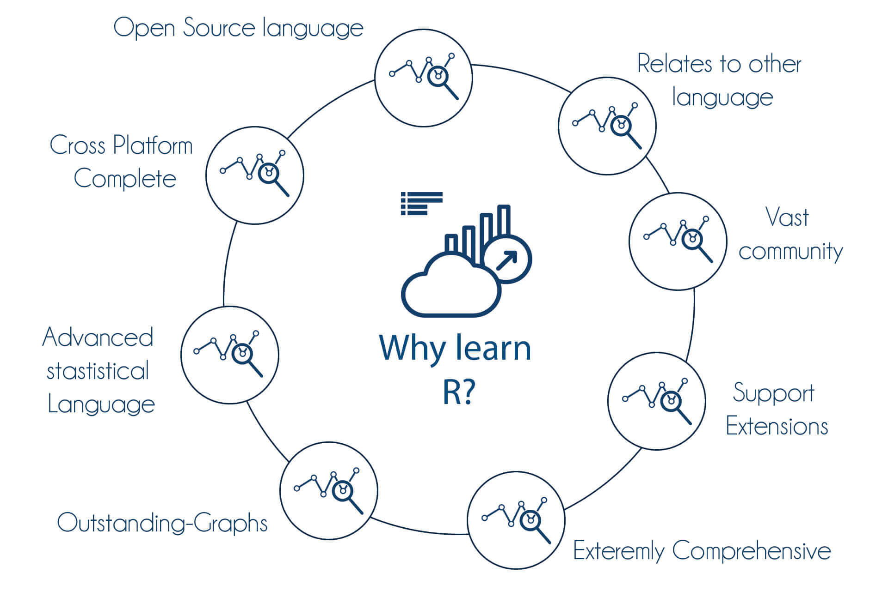

<style>
body
  { counter-reset: source-line 0; }
pre.numberSource code
  { counter-reset: none; }
</style>

&nbsp; 

```{r, echo = FALSE}

# devtools::install_github("hadley/emo")
library("emo")
library("xaringanExtra")
library("knitr")

# options to customize chunk outputs
knitr::opts_chunk$set(
  class.source = "numberLines lineAnchors", # for code line numbers
  tidy.opts = list(width.cutoff = 65), 
  tidy = TRUE,
  message = FALSE
 )

htmltools::tagList(
  xaringanExtra::use_clipboard(
    button_text = "<i class=\"fa fa-clipboard\"></i>",
    success_text = "<i class=\"fa fa-check\" style=\"color: #90BE6D\"></i>",
    error_text = "<i class=\"fa fa-times-circle\" style=\"color: #F94144\"></i>"
  ),
  rmarkdown::html_dependency_font_awesome()
)

# this is a customized printing style data frames 
# screws up tibble function
tibble <- function(x, ...) { 
  x <- kbl(x, digits=4, align= 'c', row.names = FALSE) 
   x <- kable_styling(x, position ="center", full_width = FALSE,  bootstrap_options = c("striped", "hover", "condensed", "responsive")) 
   asis_output(x)
}

registerS3method("knit_print", "data.frame", tibble)
```


```{r setting functions and parameters, echo=FALSE, message=FALSE}

# remove all objects
rm(list = ls())

# unload all non-based packages
out <- sapply(paste('package:', names(sessionInfo()$otherPkgs), sep = ""), function(x) try(detach(x, unload = FALSE, character.only = TRUE), silent = T))


options("digits"=5)
options("digits.secs"=3)

# library(knitr)
# library(kableExtra)
# 
# options(knitr.table.format = "html")
# 
# x <- c("RColorBrewer", "ggplot2")
# 
# aa <- lapply(x, function(y) {
#   if(!y %in% installed.packages()[,"Package"])  {if(y != "warbleR") install.packages(y) else devtools::install_github("maRce10/warbleR")
# }
# try(require(y, character.only = T), silent = T)
#   })
# 
# 
# theme_set(theme_classic(base_size = 50))
# 
# cols <- brewer.pal(10,"Spectral")


```
 

## Software libre y codigo 

  - Los programas libres y de código abierto permiten a las usuarias inspeccionar, modificar y mejorar su diseño mediante la disponibilidad de su código fuente

  - Código abierto es ideal para la investigación reproducible porque los scripts pueden contener todos los pasos del análisis (auto-documentación)

  - El código en general **permite a los colegas ver lo que hemos hecho y volver a ejecutar** o incluso modificar nuestros análisis

  - Las **herramientas disponibles gratuitamente las puede usar cualquiera** al contrario de las herramientas comerciales 

  - El código abierto **permite entender en detalle las herramietas de analisis**

&nbsp; 

### ¿Porqué R?

<center></center>

*www.traininginbangalore.com*

&nbsp; 

## Herramientas para la programación reproducible

&nbsp;

### Programación literaria ('literate programming')

- Consiste en documentar en detalle en qué consiste el problema, cómo se resuelve, cómo y por qué se adoptó cierto flujo de análisis, cómo se optimizó (si se optimizó) y cómo se implementó en el lenguaje de programación

- Los informes dinámicos en R facilitan el uso de programación literaria para documentar el manejo de datos y análisis estadísticos (este archivo que lee en este momento es un reporte dinámico creado en R)

- La forma principal en que R facilita la investigación reproducible es utilizando un documento que es una combinación de contenido y código de análisis de dato 

- Hablaremos luego de reportes dinámicos como una herramienta para facilitar la programación literaria 

&nbsp; 


### Ambientes reproducibles
 
  - La reproducibilidad también se trata de asegurarse de que otra persona pueda reutilizar su código para obtener los mismos resultados 

- Para esto se debe proporcionar más que el código y los datos

-  Documentar y administrar las dependencias de su proyecto correctamente puede ser complicado. Sin embargo, incluso documentación simple que ayude a otros a comprender la configuración que utilizó puede tener un gran impacto.

- Idealmente se debe documentar las versiones exactas de todos los paquetes y software que utilizó y el sistema operativo

&nbsp; 

### Información de la sesión

La forma mas sencilla de documentar el ambiente (R + paquetes y  sus versiones) con el que se hizo un análisis es usando la función `sessionInfo`:

```{r session info example, echo=F}

sessionInfo()

```

&nbsp; 

Sin embargo, esta documentación no necesariamente hace los análisis replicables ya que las versiones de los paquetes suelen actualizarse e inclusive algunos paquete pueden no estar disponibles luego de un tiempo.

&nbsp; 

### Packrat: manejo reproducible de paquetes en R

Los paquetes de R (y sus versiones específicas) usados en un análisis pueden ser difíciles de replicar: 

- ¿Alguna vez ha tenido que usar prueba y error para averiguar qué paquetes de R necesita instalar para hacer que el código de otra persona funcione? 

- ¿Alguna vez ha actualizado un paquete para que el código de uno de sus proyectos funcione, solo para descubrir que el paquete actualizado hace que el código de otro proyecto deje de funcionar?

Con el paquete `packrat` los proyectos tienen varias características útiles en términos de reproducibilidad:

- Aislamiento: la instalación de un paquete nuevo o actualizado para un proyecto no afectará a sus otros proyectos y viceversa. Eso es porque `packrat` le da a cada proyecto su propia biblioteca de paquetes privada.

- Portable: mueva fácilmente sus proyectos de una computadora a otra, incluso en diferentes plataformas. `packrat` facilita la instalación de los paquetes en los que depende su proyecto.

- Reproducible: `packrat` registra las versiones exactas del paquete de las que depende y se asegura de que esas versiones exactas sean las que se instalen dondequiera que vaya.
 
```{r, eval = F, echo = FALSE}  

 Sin embargo, los valores predeterminados en algunas funciones cambian y se introducen nuevas funciones con regularidad. Si escribió su código en una versión reciente de R y se lo dio a alguien que no se ha actualizado recientemente, es posible que no pueda ejecutar su código. El código escrito para una versión de un paquete puede producir resultados muy diferentes con una versión más reciente.


&nbsp; 

<div class="alert alert-info">

### Ejercicio 1

- XXXXX


</div>

&nbsp;

```

#### Usando packrat

1. Por supuesto, primero debemos instalar el paquete `packrat` en R:

```{r, eval = FALSE}

# instalar paquete
install.packages("packrat")

```
&nbsp; 

2. Ahora, creemos un proyecto de R nuevo (en un directorio nuevo).

3. Luego de crear un proyecto (o moverse a uno existente) podemos iniciar el monitoreo y manejo de paquetes con `packrat` así: 

```{r, eval = FALSE}

# iniciar packrat en proyecto
packrat::init(path = "/directorio/del/proyecto")

```
&nbsp; 

Si el directorio de trabajo esta definido como el directorio del proyecto no es necesario definir el 'path':

```{r, eval = FALSE}

# iniciar packrat en proyecto
packrat::init()

```
&nbsp; 

Luego de esto el uso de paquetes en este proyecto sera manejado por `packrat` (verán algunas diferencias en lo que imprime la consola de R cuando instalen paquetes). Osea ya estamos usando `packrat`. 
Un proyecto `packrat` contiene algunos archivos y directorios adicionales. La función `init()` crea estos archivos y directorios si aún no existen:

 - **packrat/packrat.lock**: enumera las versiones precisas del paquete que se utilizaron para satisfacer las dependencias, incluidas las dependencias de las dependencias (¡nunca debe editarse a mano!).
 - **packrat/packrat.opts**: Opciones de `packrat` específicas del proyecto. Estos se pueden consultar y configurar con get_opts y set_opts; consulte "packrat-options" para obtener más información.
- **packrat/lib/**: biblioteca de paquetes privada para este proyecto.
 - **packrat/src/**: paquetes fuente de todas las dependencias de las que se ha informado a packrat.
 - **.Rprofile**: indica a R que utilice la biblioteca de paquetes privada cuando se inicia desde el directorio del proyecto.


La única diferencia con otros proyectos es que los proyectos que usan `packrat` tienen su propia biblioteca de paquetes. Esta se encuentra en  `/directorio/del/proyecto/packrat/lib`. Por ejemplo instalemos un par de paquetes nuevos, pueden ser algunos con que estén familiarizados o estos que tenemos acá como ejemplo:

```{r, eval = FALSE}

install.packages("fun")

```
&nbsp; 

Cada vez que instalamos uno o mas paquetes es necesario tomar actualizar el estado del rastreo de `packrat`. Esto lo hacemos asi:

```{r, eval = FALSE}
# revisar estado actual
packrat::status()

# actualizar packrat en proyecto
packrat::snapshot()

```
&nbsp; 

Con este paquete podemos jugar en R:

```{r, eval = FALSE}
# ejemplo de un juego X irrelevante
library(fun)

if (.Platform$OS.type == "windows")
         x11() else x11(type = "Xlib")

mine_sweeper()

```
&nbsp; 

O tomar una prueba de Alzheimer:

```{r, eval = FALSE}

# otro juego un poco menos irrelevante
x = alzheimer_test()

```
&nbsp; 

Si removemos un paquete que utilizamos en el proyecto lo podemos reinstalar usando `restore()`:

```{r, eval = FALSE}
# remover
remove.packages("fun")

# ver estado actual
packrat::status()

# restaurar
packrat::restore()

```


Nuevos paquetes pueden ser instalados:

```{r, eval = FALSE}

# instalar
install.packages("cowsay")

# cargar
library(cowsay)

# diagrama
say("Hello world!")

# echo aleatorio
say("rms")

```

```{r, echo = FALSE}

# instalar
# install.packages("cowsay")

# cargar
library(cowsay)


```

```{r, echo = FALSE, eval = TRUE}

# echo aleatorio
say("Hello world!")

```


```{r, echo = TRUE, eval = FALSE}

# echo aleatorio
say("rms")

```
&nbsp; 

```{r, echo = FALSE, eval = TRUE}

# echo aleatorio
say("rms")

```
&nbsp; 


...y deben ser "referenciados" en la misma forma:
```{r, eval = FALSE}
# revisar estado actual
packrat::status()

# actualizar packrat en proyecto
packrat::snapshot()

```
&nbsp; 

En este [repositorio de github](https://github.com/maRce10/ejemplo_packrat_repo) hay un proyecto de R con `packrat`. Lo podemos clonar solo para ver como funciona sin necesidad de instalar los paquetes:

```{r eval = FALSE}

git clone https://github.com/maRce10/ejemplo_packrat_repo.git


```


---

<font size="5">Información de la sesión</font>

```{r session info, echo=F}

sessionInfo()

```

