<style>
body
  { counter-reset: source-line 0; }
pre.numberSource code
  { counter-reset: none; }
</style>

&nbsp; 

```{r, echo = FALSE}

# devtools::install_github("hadley/emo")
library("emo")
library("xaringanExtra")
library("knitr")

# options to customize chunk outputs
knitr::opts_chunk$set(
  class.source = "numberLines lineAnchors", # for code line numbers
  tidy.opts = list(width.cutoff = 65), 
  tidy = TRUE,
  message = FALSE
 )

htmltools::tagList(
  xaringanExtra::use_clipboard(
    button_text = "<i class=\"fa fa-clipboard\"></i>",
    success_text = "<i class=\"fa fa-check\" style=\"color: #90BE6D\"></i>",
    error_text = "<i class=\"fa fa-times-circle\" style=\"color: #F94144\"></i>"
  ),
  rmarkdown::html_dependency_font_awesome()
)

# this is a customized printing style data frames 
# screws up tibble function
tibble <- function(x, ...) { 
  x <- kbl(x, digits=4, align= 'c', row.names = FALSE) 
   x <- kable_styling(x, position ="center", full_width = FALSE,  bootstrap_options = c("striped", "hover", "condensed", "responsive")) 
   asis_output(x)
}

registerS3method("knit_print", "data.frame", tibble)
```

<!-- skyblue box -->

<div class="alert alert-info">

# Objetivos del manual

- Familiarizarse con el formato para reportes dinámicos Rmarkdown

- Ser capaz de documentar el manejo y análisis de datos en R usando Rmarkdown

</div>

&nbsp; 

Paquetes a utilizar en este manual:

```{r}

# vector con paquetes
ptqs <- c("leaflet", "remotes", "hadley/emo", "maRce10/sketchy", "knitr", "rmarkdown", "kableExtra", "rmdformats", "revealjs", "rticles", "tufte")

# bucle para instalar/cargar paquetes
instalado <- sapply(ptqs, function(y) {
  
  ptq <- strsplit(y, "/")[[1]]
  ptq <- ptq[length(ptq)]
  
  if (!ptq %in% installed.packages()[,"Package"])  {
      if (grepl("/", y))  remotes::install_github(y, force = TRUE) else install.packages(y) 
  }
  
  try(require(ptq, character.only = TRUE), silent = TRUE)
})


```

&nbsp; 

---

## Crisis de reproducibilidad en la ciencia

La mayoría de los procedimientos (incluyendo análisis de datos) en estudios científicos no se pueden replicar

```{r, echo=FALSE,out.width="70%", fig.align='center'}


knitr::include_graphics("./images/nature-reproducibility-crisis.jpeg")

```

[*Baker. 2016. Nature*](https://www.nature.com/articles/533452a)

 
El compartir datos y análisis de forma transparente y detalladamente documentada, en formatos que puedan ser reproducidos por otros investigadores es una de las principales herramientas para lidiar con este problema.  

```{r, echo=FALSE,out.width="100%", fig.align='center'}

knitr::include_graphics("./images/soluciones_reproducible.png")

```

*Gallagher et al. 2020. Nature Eco & Evo* 

Las herramientas programáticas como R tienden naturalmente a facilitar la reproducibilidad ya que el código de un análisis se puede registrar y compartir fácilmente. Muchos lenguajes de programación permiten la generación de reportes dinámicos, los cuales resultan fundamentales para hacer manejo de datos y análisis estadísticos reproducibles. Los reportes dinámicos suelen contener toda la información necesaria para que otros investigadores puedan replicar todos los pasos de análisis que generaron los resultados de artículos científicos. Por tanto son una herramienta indispensable para mejorar la reproduciblidad en la ciencia.

En R la herramienta mas popular para la generación de reportes dinámicos es Rmarkdown. Rmarkdown [se puede describir](http://rmarkdown.rstudio.com) como "*un formato eléctronico de documentación que facilita la creación de documentos, presentaciones e informes dinámicos desde R*". R Markdown puede generar documentos con bloques de código de R ("chunks") incrustados entre líneas de texto. Cuando se procesa el documento, estos bloques se evalúan (si el usuario así lo desea) y los resultados se "imprimen" en el documento de acuerdo con ciertas convenciones.

&nbsp;

### Ventajas de los reportes dinámicos con Rmarkdown:

- El **código R se puede incrustar en el informe**, por lo que no es necesario mantener el informe y el código de R por separado

- Incluir el código R directamente en un informe proporciona una **estructura intuitiva** para reproducir los análisis

- El texto del informe está **escrito como texto normal**, por lo que no se requieren conocimientos de programación (i.e. R o HTML) para comprenderlos

- **El resultado es un archivo HTML** que incluye imágenes, bloques de código con los comandos de R, los resultados de estos códigos y texto. No se necesitan archivos adicionales, todo está incorporado en el archivo HTML.

- Los informes son **fáciles de compartir por correo o publicarlos en línea**

- Estos informes **facilitan la colaboración y mejoran la reproducibilidad** (entender los análisis es mucho mas fácil cuando hay texto explicativo, código de R, los resultados del código y los gráficos en un mismo archivo)

- **Se actualizan fácilmente** para incluir nuevos análisis y/o integrar nuevos datos 

&nbsp;

---

# Crear documentos R Markdown

Usaremos [Rstudio](www.rstudio.com) para crear documentos R Markdown. Empiece por seleccionar "R Markdown ..." en el menú desplegable que aparece cuando crea un nuevo archivo:


```{r, echo=FALSE,out.width="70%", fig.align='center'}

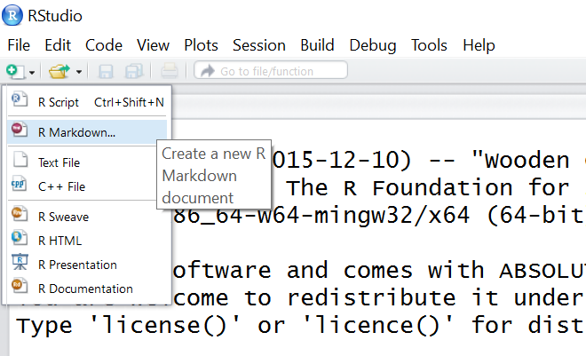

```

<font size="3"> <i>Nota: es posible que se le solicite aquí que instale varios paquetes necesarios para que R Markdown funcione.</i></font> 

&nbsp; 

Aparecerá una ventana que le pedirá un título y autor para el nuevo documento (esto no es tan relevante en este punto y puedo ser modificado fácilmente luego), así como el formato. Seleccione 'HTML' ya que nos interesa convertirlo a un formato de visualización universal. Puede cambiar sus preferencias de salida de 'HTML' a 'PDF' o 'Word' en cualquier momento:

```{r, echo=FALSE,out.width="70%", fig.align='center'}

knitr::include_graphics("./images/image2.PNG")

```

&nbsp; 

Esto lo llevará a su primer archivo '.Rmd' (o R Markdown). El nuevo archivo ya viene con una plantilla con instrucciones básicas:

```{r, echo=FALSE,out.width="100%", fig.align='center'}

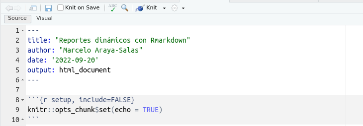

```
&nbsp; 

&nbsp;

<div class="alert alert-info">

## Ejercicio 1

Cree un nuevo archivo R Markdown, escriba algunas líneas de texto y haga clic en "Knit" para ver cómo se verá su reporte.

&nbsp;

```{r, echo=FALSE,out.width="90%", fig.align='center'}

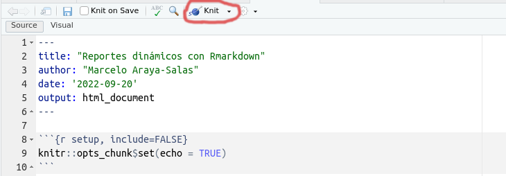

```

</div>

&nbsp; 

# Syntaxis Markdown

Markdown (y por extensión Rmarkdown) tiene sus propias reglas sintácticas. Sin embargo, este lenguaje es relativamente simple y fácil de dominar:

_____


## Crear encabezados de varios tamaños 

Código:

```{r, echo=FALSE,out.width="50%", fig.align='center'}

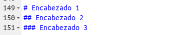

```

Resultado:

# Encabezado 1 
## Encabezado 2  
### Encabezado 3

_____


## Opciones del texto

&nbsp; 

Código:

```{r, echo=FALSE,out.width="90%", fig.align='center'}

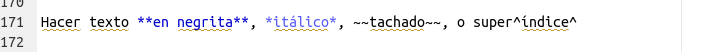

```

Resultado:

Hacer texto **en negrita**, *itálico*, ~~tachado~~, o super^índice^

_____

## Añadir una imagen

Código:

```{r, echo=FALSE,out.width="50%", fig.align='center'}

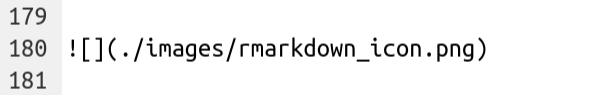

```

Resultado:

```{r, echo=FALSE,out.width="40%", fig.align='center'}

knitr::include_graphics("./images/rmarkdown_icon.png")

```

También podemos añadir una imagen con la función `include_graphics()` del paquete knitr.

Código:

```{r, eval = FALSE}

include_graphics("./images/rmarkdown_icon.png")

```

Resultado:

```{r, echo=FALSE,out.width="40%", fig.align='center'}

knitr::include_graphics("./images/rmarkdown_icon.png")

```

Note que esta opción nos permite hacer uso de los argumentos del bloque de código dedicados a la graficación, y po r tanto es una opción mas flexible.

_____


## Crear enlaces ('hyperlinks')

Código:

```{r, echo=FALSE,out.width="70%", fig.align='center'}

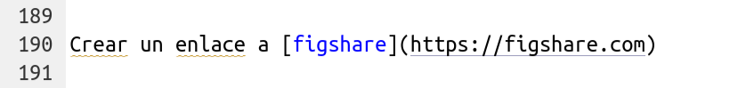

```

Resultado:

Crear un enlace a [figshare](https://figshare.com)

&nbsp;

<div class="alert alert-info">

## Ejercicio 2

&nbsp;

2.1 Cree unos encabezados y sub-encabezados en su documento Rmarkdown

&nbsp;

2.2  Añada texto con algunas palabras **en negrita** y en *italica*

&nbsp;
 
2.3 Incruste una imagen de su organismo favorito (o un gif)

&nbsp;

2.4 Añada un enlace URL

</div>

&nbsp; 

## Incrustar código

Para incrustar el código de R, tenemos que definir un área donde se encuentra el código. Esta 'área' se conoce como un bloque de código (o 'chunk') y se define mediante:

```{r, echo=FALSE,out.width="30%", fig.align='center'}

knitr::include_graphics("./images/image9.PNG")

```

&nbsp;

Observe que el recuadro de R está en gris, mientras que el resto está en fondo blanco. Todo lo que se incluye en el segmento se evalúa y muestra de acuerdo con las especificaciones, aunque estas se pueden modificar.

&nbsp;

Podemos, por ejemplo, agregar una nueva columna al conjunto de datos de ejemplo de iris:

```{r, echo=FALSE,out.width="70%", fig.align='center'}

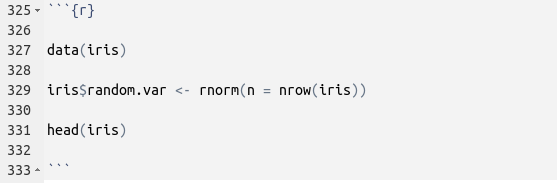

```

Resultado:
```{r}

data(iris)

iris$random.var <- rnorm(n = nrow(iris))

head(iris)

```

&nbsp;

Cuando se procesa su documento, el segmento de código se muestra en un cuadro gris y los resultados de ese código se muestran en un cuadro blanco. ¿Qué pasa si solo desea que se muestre la salida de su código? ¿O que su código se muestre pero no se ejecute realmente? Hay argumentos que puede agregar a cada uno de sus bloques para especificar estas y otras opciones:

_____

## Ocultar código

Añadir el argumento `echo=FALSE`

Código:

```{r, echo=FALSE,out.width="90%", fig.align='center'}

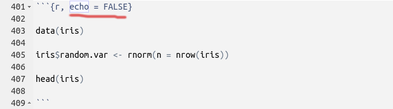

```

Resultado:

```{r, echo = FALSE}

data(iris)

iris$random.var <- rnorm(n = nrow(iris))

head(iris)

```

&nbsp;

Puede ver que el código está oculto pero se muestran los resultados.

[Esta guía](https://rstudio.com/wp-content/uploads/2015/03/rmarkdown-spanish.pdf) sobre las opciones de los bloques de código puede ser muy útil:

```{r, echo=FALSE,out.width="100%", fig.align='center'}

knitr::include_graphics("./images/image12.PNG")

```

&nbsp;

[En este enlace](https://yihui.org/knitr/options/) se detallan todos los argumentos disponibles para personalizar los bloques de código. 

&nbsp;


## Incrustar gráficos

Los gráficos se pueden incrustar en documentos Rmarkdown simplemente usando funciones de graficación como lo haría en un script de R normal.


#### Código:

```{r, echo=FALSE,out.width="90%", fig.align='center'}

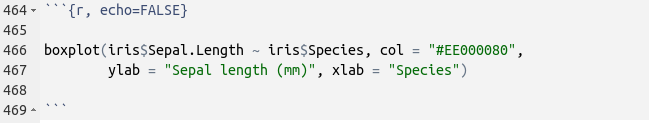

```

&nbsp; 

#### Resultado:

```{r, echo=FALSE}

boxplot(iris$Sepal.Length ~ iris$Species, col = "#EE000080", 
        ylab = "Sepal length (mm)", xlab = "Species")

```

&nbsp; 

<div class="alert alert-info">

## Ejercicio 3

&nbsp;

3.1 Utilice los argumentos `eval`, `collapse` con diferentes valores (TRUE o FALSE) en un segmento donde corre `head(iris)`. ¿Cómo afectan el resultado?

&nbsp;

3.2 Haga lo mismo con los argumentos `out.width`, `fig.width`,` dpi` y `fig.height` en un segmento que cree un gráfico. ¿Cómo afecta esta vez?

</div>

&nbsp; 

## Incrustar código de R en el texto

Es posible que haya notado a lo largo de este tutorial que tengo pequeños fragmentos de texto que parecen "bloques de código". Esto se conoce como incrustación de código en texto.

Esto se puede hacer de dos maneras:

#### 1.Dar un  texto con la apariencia de un segmento de código:
_____

#### Código: 

```{r, echo=FALSE,out.width="80%", fig.align='center'}

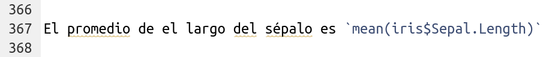

```

&nbsp;

#### Resultado:

El promedio del largo del sépalo es `mean(iris$Sepal.Length)`

&nbsp;

#### 2. Evaluar el código en el texto

#### Código:

```{r, echo=FALSE,out.width="70%", fig.align='center'}

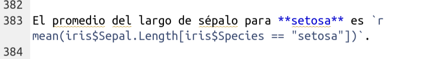

```

#### Resultado:

El promedio del largo de sépalo para **setosa** es `r mean(iris$Sepal.Length[iris$Species == "setosa"])`.

&nbsp;

---

# Recursos adicionales para personalizar documentos Rmarkdown

## Metadatos (YAML)

Hay tres componentes básicos de un documento de R Markdown: los metadatos, el texto y el código. Los metadatos se escriben entre el par de tres guiones ("- - -") generalmente al inicio del documento. La sintaxis de los metadatos es [YAML (YAML Ain’t Markup Language)](https://en.wikipedia.org/wiki/YAML), por lo que a veces también se denomina metadatos YAML. La sangría es importante en YAML, así que debe añadirla a los subcampos (con respecto a un campo superior).

Este encabezado muestra las opciones mas comúnmente usadas en los metadatos YAML:

```{r, eval = FALSE}

---
title: "Un titulo descriptivo y sin faltas ortograficas"
author: "Marcelo Araya"
date: "`r Sys.Date()`"
output: # Varios outputs mostrados solo para el ejemplo
  html_document:
    fig_caption: yes
    number_sections: yes
    toc: yes
    toc_float: yes
    df_print: paged
---

```

[En este enlace](https://bookdown.org/yihui/rmarkdown/html-document.html) se explican en detalle las opciones disponibles en el encabezado YAML de archivos Rmarkdown.

&nbsp;


## Emojis

El paquete [emo](https://github.com/hadley/emo) permite añadir emojis al evaluar un código:

```{r, results='asis'}

emo::ji("costa_rica")

```


Tambien se puede incrustar en el texto `r ji("costa_rica")`, como lo vimos [mas arriba](#incrustar-código-de-r-en-el-texto) `r ji("up_arrow")` (`ji("up_arrow")`)

&nbsp;


## Cuadros con knitr::kable

El paquete `knitr` también provee una función para mostrar datos tabulares de forma ordenada y 'limpia' en los reportes dínamicos:

```{r, eval = FALSE, echo=TRUE}

knitr::kable(iris[1:10, ])

```

```{r, echo = FALSE}
iris[1:10, ]


```

&nbsp;

El paquete [`kableExtra`](https://cran.r-project.org/web/packages/kableExtra/vignettes/awesome_table_in_html.html) complementa esta función con muchas herramientas para personalizar el formato de las tablas en reportes dinámicos en R.

&nbsp;

## Opciones adicionales en knitr

El argumento `opts_knit` de `knitr` permite definir opciones globales (aplicables a todos los bloques a menos que se re-definan):

```{r, eval = FALSE}

opts_chunk$set(root.dir = "..", eval = TRUE, echo = FALSE)

```

&nbsp;

##  Presentaciones y otros opciones de formato

Note en la ventana de creación de un nuevo documento Rmarkdown las opciones adicionales de formato:

```{r, echo=FALSE,out.width="70%", fig.align='center'}

knitr::include_graphics("./images/image16.PNG")

```
&nbsp;

Los reportes dinámicos se pueden generar en otros formatos incluyendo presentaciones, pdf y documentos de word.

&nbsp;

## Plantillas de Rmarkdown

El paquete Rmarkdown puede generar resultados en HTML, PDF, MS Word, viñetas de paquetes de R, presentaciones Beamer y HTML5. Los formatos adicionales (o 'variantes' de estos formatos) están disponibles en otros paquetes de R. Algunos de esos paquetes son:

   - rmdformats
   - reveljs
   - artículos
   - tufte


Una vez estos paquetes han sido instalados, los nuevos formatos estarán disponibles a través del nuevo cuadro de diálogo Rmarkdown:

```{r, echo=FALSE,out.width="70%", fig.align='center'}

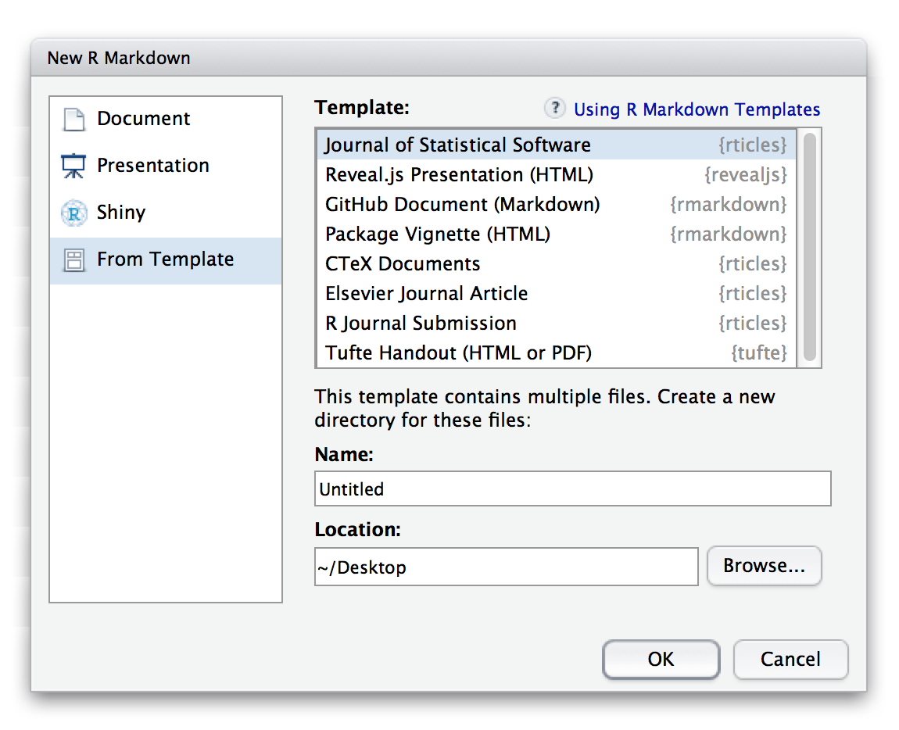

```
&nbsp;

---

# Documentos interactivos

Los documentos de R Markdown también pueden generar contenido interactivo. Hay dos tipos de documentos interactivos de R Markdown: HTML Widgets y aplicaciones Shiny.

&nbsp;

## HTML widgets

Los HTML Widgets se implementan con el paquete R `htmlwidgets`, que conecta herramientas de JavaScript que crean aplicaciones interactivas, como gráficos y tablas Se han desarrollado varios paquetes que emplean HTML widgets como `dygraphs`, `DT` y `leaflet`. En este [sitio (https://www.htmlwidgets.org)](https://www.htmlwidgets.org) se muestran una variedad de widgets disponibles así como instrucciones de como desarrollarlos.

El siguiente código utiliza el paquete `leaflet` para generar un mapa interactivo:

```{r out.width = '100%', echo = TRUE, as.is = TRUE}

ll_map <- leaflet()

ll_map <- addTiles(map = ll_map)

ll_map <- setView( map = ll_map, lat = 5.527448, lng = -87.057245, zoom = 13)

addPopups( map = ll_map, lat = 5.527448, lng = -87.057245, popup = 'Isla del Coco')

```

&nbsp;

Este es el bloque de código que generó el mapa:

```{r, echo=FALSE,out.width="90%", fig.align='center'}

knitr::include_graphics("./images/leaflet.png")

```

&nbsp;

Note el uso del argumento de `as.is = TRUE` en las opciones del bloque de código.

&nbsp;


## Aplicaciones shiny

El paquete `shiny` crea aplicaciones web interactivas en R. Para llamar al código `shiny` desde un documento R Markdown, agregue 'runtime': shiny a los metadatos YAML, como en este ejemplo:

```{r, eval = FALSE}

---
title: "Documento Shiny"
output: html_document
runtime: shiny
---

```
&nbsp;

El siguiente código crea una aplicación shiny dentro del documento Rmarkdown:

```{r, eval = FALSE}

ui <- fluidPage(
  
  titlePanel("Ejemplo"),
  
  sidebarLayout(
    sidebarPanel(
      sliderInput(inputId = "bins",
                  label = "Numero de barras:",
                  min = 1,
                  max = 50,
                  value = 30)
      
    ),
    mainPanel(
      plotOutput(outputId = "distPlot")
    )
  )
)

server <- function(input, output) {
 
  output$distPlot <- renderPlot({
    
    x    <- faithful$waiting
    bins <- seq(min(x), max(x), length.out = input$bins + 1)
    
    hist(x, breaks = bins, col = "#3E4A89FF", border = "white",
         xlab = "Tiempo de espera para la siguiente erupcion",
         main = "Histograma del tiempo de espera")
  })
}

# Crear Shiny app
shinyApp(ui = ui, server = server)

```

&nbsp;

Note que esta aplicación no funciona en documentos estáticos de Rmarkdown. En el sitio [https://shiny.rstudio.com/gallery](https://shiny.rstudio.com/gallery/#demos) pueden encontrar muchos ejemplos de aplicaciones shiny. Estas aplicaciones son complejas de incluir en archivos auto-contenidos y por ello no son tan amigables para reportes dinámicos como los que podemos generar con R markdown. 

&nbsp;


# Publicar reportes en linea con Rpubs


La plataforma en linea [Rpubs](rpubs.com/) permite publicar los reportes en formato HTML. Esta opción simplifica mucho el compartir códigos, análisis y resultados ya que solamente necesitamos enviar el la dirección URL. Aún mas, podemos seguir actualizando los reportes y la misma dirección URL seguirá conteniendo las versiones actualizadas de los reportes.

Para enviar nuestros reportes HTML a [Rpubs](rpubs.com/) debemos primero hacer una cuenta en el sitio. Luego de esto simplemente tenemos que usar el enlace "publish" en la esquina superior derecha de los reportes:

```{r, echo=FALSE,out.width="90%", fig.align='center'}

knitr::include_graphics("./images/rpubs.PNG")

```

&nbsp;

---

# Herramientas adicionales para organizar análisis de datos

## Proyectos de Rstudio

Los proyectos de Rstudio crean carpetas donde se guardan los archivos relacionados a un análisis específico (código y datos) y hacen de esta carpeta el directorio de trabajo por defecto cuando se abre el proyecto. Se pueden crear de esta forma:

```{r, echo=FALSE,out.width="50%", fig.align='center'}

knitr::include_graphics("./images/rproj1.png")

```


Luego aparecera una seria de ventanas donde pueden escoger que tipo de proyecto y el nombre de este:
```{r, echo=FALSE,out.width="100%", fig.align='center'}

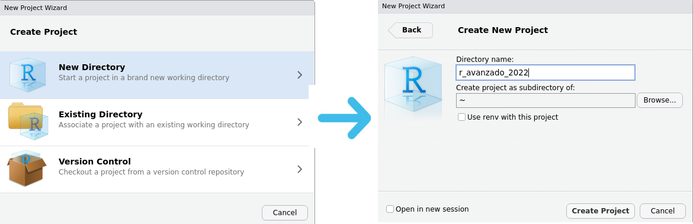

```

&nbsp;


## Compendios de investigación

Los compendios de investigación son estructuras de carpetas pre-definidas que permiten seguir un orden lógico e intuitivo para organizar los archivos usados y generados en un análisis de datos de un proyecto de investigación. El paquete [sketchy](https://marce10.github.io/sketchy/) genera estos compendios, permitiendo al usuario seleccionar entre una gama de compendios comunes en la comunidad científica. Este ejemplo crea el compendio básico (uno de los 14 que vienen con el paquete):


```{r}

path <- tempdir()

make_compendium(name = "proyecto_x", path = path, format = "basic", Rproj = TRUE)

```

El paquete crea archivos Rmarkdown con plantillas para el análisis de datos (carpeta "scripts") y escritura de manuscritos (carpeta "manuscript"). Corra `path` en la consola de R para ver la dirección de la carpeta donde se creo el compendio.


&nbsp;


<div class="alert alert-info">

## Ejercicio 4

&nbsp;

-  Cree un reporte dinámico que incluya un mapa dinámico de Costa Rica usando el paquete `leaflet` 

&nbsp;

-  Reproduzca alguno de los ejemplos disponibles en el sitio del paquete dygraphs ([https://rstudio.github.io/dygraphs/](https://rstudio.github.io/dygraphs/)) e incrústelo en su reporte dinámico  

&nbsp;

- Instale el paquete `kableExtra` y incruste en su reporte el códifo de ejemplo en la documentación de la función `kable_styling()` de ese paquete

&nbsp;

- Cree una presentación Rmarkdown utilizando la opción "Presentation" en la ventana de creación

&nbsp;

- Genere un reporte dinámico en formato PDF

&nbsp;

- Cree un proyecto de Rstudio para organizar los contenidos del curso 

&nbsp;

- Cree un compendio de investigación con sketchy

</div>

&nbsp;

---

## Referencias

  - [R Markdown: The Definitive Guide](https://bookdown.org/yihui/rmarkdown/)
  - [Rmarkdown custom format](https://blog.rstudio.com/2016/03/21/r-markdown-custom-formats/)
  - [Rmarkdown website](https://rmarkdown.rstudio.com/index.html)
  - [Jacolien van Rij: Rmarkdown variants](http://www.jacolienvanrij.com/Tutorials/tutorialMarkdown.html)
  - [Danielle Quinn: R Lessons](https://github.com/DanielleQuinn/RLessons)
  - Vaidyanathan, Ramnath, Yihui Xie, JJ Allaire, Joe Cheng, and Kenton Russell. 2019. Htmlwidgets: HTML Widgets for R. https://github.com/ramnathv/htmlwidgets.
  
---

---

<font size="4">Información de la sesión</font>

```{r session info, echo=F}

sessionInfo()

```
