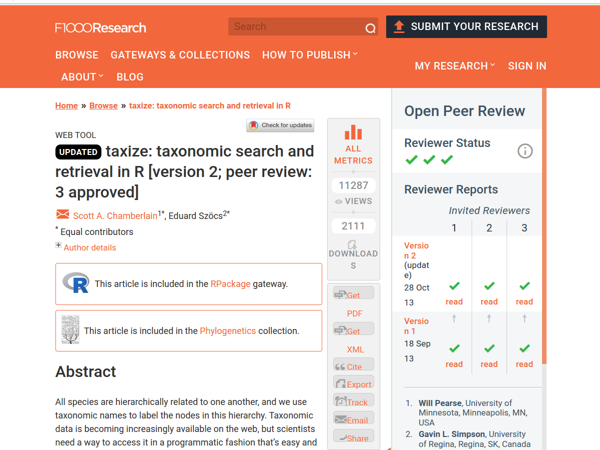
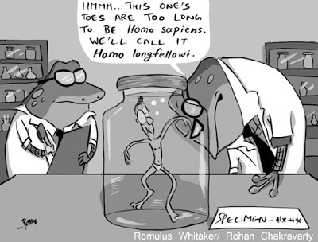
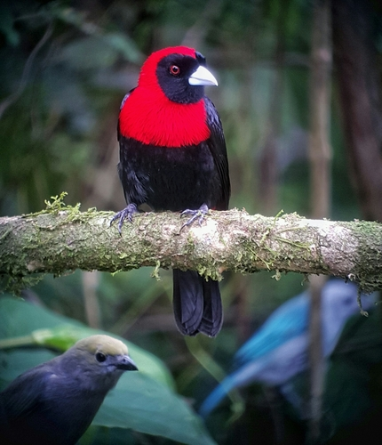

<style>
body
  { counter-reset: source-line 0; }
pre.numberSource code
  { counter-reset: none; }
</style>

&nbsp; 

```{r, echo = FALSE}

# devtools::install_github("hadley/emo")
library("emo")
library("xaringanExtra")
library("knitr")

# options to customize chunk outputs
knitr::opts_chunk$set(
  class.source = "numberLines lineAnchors", # for code line numbers
  tidy.opts = list(width.cutoff = 65), 
  tidy = TRUE,
  message = FALSE
 )

htmltools::tagList(
  xaringanExtra::use_clipboard(
    button_text = "<i class=\"fa fa-clipboard\"></i>",
    success_text = "<i class=\"fa fa-check\" style=\"color: #90BE6D\"></i>",
    error_text = "<i class=\"fa fa-times-circle\" style=\"color: #F94144\"></i>"
  ),
  rmarkdown::html_dependency_font_awesome()
)

# this is a customized printing style data frames 
# screws up tibble function
tibble <- function(x, ...) { 
  x <- kbl(x, digits=4, align= 'c', row.names = FALSE) 
   x <- kable_styling(x, position ="center", full_width = FALSE,  bootstrap_options = c("striped", "hover", "condensed", "responsive")) 
   asis_output(x)
}

registerS3method("knit_print", "data.frame", tibble)
```


## Introducción
Un aspecto de reproducibilidad científica que es específico de las ciencias biológicas es cómo se obtiene, usa y reporta la información taxonómica. En la discusión tratamos los temas del uso de vouchers y la importancia de documentar adecuadamente la justificación de identificaciones taxonómicas. Aquí vamos a ver una herramienta para obtener y curar información taxonómica de manera reproducible.

Vamos a usar el paquete en R ['taxize'](https://github.com/ropensci/taxize). Por cierto, el artículo que describe el paquete fue publicado en la revista [F1000Research](https://f1000research.com/articles/2-191/v2), una de las revistas que vimos al comienzo del semestre es completamente abierta.

<p align="center">

<p align="center">
<font size="2">[Chamberlian y Szöcs (2013)](https://f1000research.com/articles/2-191/v2). 
</p>

## ¿Por qué 'taxize'?

Existen bases de datos en línea de las que se puede obtener información taxonómica para diversos organismos biológicos. Pero existen ventajas de hacer estás búsquedas de manera programática:
 
 1. es más eficiente si tiene que buscar bastantes taxones
 2. la búsqueda se convierte en una parte reproducible del flujo de trabajo
 
 La idea de taxize es hacer la extracción y uso de la iformación taxonómica fácil y reproducible.
 
 <p align="center">

<p align="center">
<font size="2"> Imagen: Rohan Chakravarty/[CC BY-NC-ND 3.0](https://creativecommons.org/licenses/by-nc-nd/3.0/).
</p>

## ¿Qué hace 'taxize'?
 'taxize' se conecta con varias [bases de datos taxonómicas](https://f1000research.com/articles/2-191/v2#T1) y más pueden ir siendo agregagas paulatinamente. Esta información se puede utilizar para llevar a cabo tareas comunes en el proceso de investigación. Por ejemplo:
 
### Resuelve nombres taxonómicos
Si tenemos una lista de especímenes, posiblemente queremos saber si estamos usando nombres actualizados y si los nombres que tenemos están escritos correctamente. Podemos hacer esto usando la aplicación Global Names Resolver [(GNR)](http://resolver.globalnames.org/) de la [Encyclopedia of Life](https://eol.org/), a través de taxize.

Como un ejemplo, veamos los datos de ocurrencia que bajé de [GBIF](https://www.gbif.org/). Bajé los registros de pajaritos del género *Ramphocelus* en Costa Rica, en la Colección Nacional de Zoología. Tal vez, estoy haciendo o planeo hacer un trabajo con estos espécimenes. 

Los datos están aquí (https://doi.org/10.15468/dl.d8frtc)

y este es un ejemplo del pajarito:
  
<p align="center">

<p align="center">
<font size="2"> *Ramphocelus sanguinolentus*, La Fortuna, Costa Rica
</p>

```{r}
# leamos los datos
dat <- read.csv(file = "./additional_files/0098054-200613084148143.csv", header = T, sep = "\t")

# cuales son las especies en CR?
Ram.names <- levels(dat$species)
Ram.names
```

Veamos cuáles bases de datos puedo usar para buscar los nombres de mis especies
```{r, message=FALSE}
require(taxize)
require(kableExtra)
data.sources <- gnr_datasources() 
    data.sources[,c(1,5,8,9)]%>%
  kbl() %>%
  kable_minimal()
```

Revisemos si están escritos correctamente
```{r, eval = FALSE}
name.res <- gnr_resolve(sci = Ram.names,data_source_ids = c(3:4))        
name.res[,-1]%>%
  kbl() %>%
  kable_minimal()
```

¿Y si no lo estuvieran?
```{r}
Ram.names2 <- Ram.names
Ram.names2[2] <- "Ramphocelus passerini"
name.res2 <- gnr_resolve(sci = Ram.names2,data_source_ids = c(3:4))        
name.res2[,-1]%>%
  kbl() %>%
  kable_minimal()
```

### Identifica sinónimos

Busquemos si hay sinónimos para estas especies
```{r, eval = FALSE}
synonyms(sci_id = Ram.names, db = "itis") 
```

Para usar algunas bases de datos es necesario obtener un 'API key' Esto no se puede hacer automáticamente con 'taxize' pero se puede obtener instrucciones de cómo obtener y guardar el API key para usarlo desde R.
Veamos un par de ejemplos:
```{r, eval=FALSE}
use_tropicos()
use_iucn()
use_entrez()

# para más información
?key_helpers()
?`taxize-authentication`
```
 
<style>
div.ejercicios { background-color:#F5F5DC; border-radius: 5px; padding: 5px}
div.discu { background-color:#6699CC; border-radius: 5px; padding: 5px}
</style>
<div class = "ejercicios">
#### Ejercicio 1

1. Instale el paquete 'usethis' con el commando `install.packages("usethis")`
2. Obtenga el 'API key' para una base de datos de su interés
3. Añada este 'API key' a su ambiente en R con el comando `usethis::edit_r_environ()`
4. Reinicie R y verifique que tiene el  'API key' usando `getkey()`
5. Si todo salió bien, ya lo vamos a usar.
</div>
&nbsp; 

```{r, include=FALSE}
getkey(service = "entrez")
```
 
### Extrae clasificación taxonómica
Podemos obtener información sobre la clasificación taxonómica superior de nuestras especies. Si su clave es para 'tropicos' o 'entrez' puede usar las bases de datos respectivas (tropicos y ncbi). Por ejemplo:
```{r, eval = FALSE}
Ram.class <- classification(Ram.names, db = "ncbi")
Ram.class[[1]]%>%
  kbl() %>%
  kable_minimal()
```

y si sólo queremos saber la familia...
```{r}
Ram.fam <- tax_name(sci = Ram.names, get = "family", db = "ncbi")
Ram.fam%>%
  kbl() %>%
  kable_minimal()
```

### Obtiene los nombres corriente abajo
Ta vez queremos saber cuáles o cuántos son los miembros de un cierto grupo taxonómico. Por ejemplo, ¿cuántas especies hay en el género *Ramphocelus*?
```{r, eval = FALSE}
# separemos el genero
genus <- strsplit(Ram.names[1], " ")[[1]][1]

# obtengamos las especies
Ram.down <- downstream(sci_id = genus, downto = "species", db = "ncbi")
Ram.down[[1]]%>%
  kbl() %>%
  kable_minimal()
```

### Obtiene información del estado de conservación
Si tienen el 'API key' para IUCN, pueden obtener información sobre el estado de consevación. 

*OJO: los autores de 'taxize' advierten usar con mucho cuidado ya que puede haber errores*

```{r, eval=F}
Ram.sum <- iucn_summary(Ram.names)
iucn_status(Ram.sum)
get_iucn(Ram.names)
```

## Ejemplos de aplicaciones en ciencia reproducible
Veamos algunos ejemplos de cómo usar herramientas como 'taxize'contribuyen a investigación más reproducible.

### Listas de hospederos en miles de comunidades
<p align="center">

<p align="center">
<font size="2"> Artículo de [Gibb et al. 2020, Nature](https://www.nature.com/articles/s41586-020-2562-8)
</p>

**De la sección de métodos:**
  
"*We compiled animal host–pathogen associations from several source databases, to provide as comprehensive a dataset as possible of zoonotic host species and their pathogens: the Enhanced Infectious Diseases (EID2) database; the Global Mammal Parasite Database v.2.0 (GMPD2) which collates records of parasites of cetartiodactyls, carnivores and primates; a reservoir hosts database; a mammal–virus associations database; and a rodent zoonotic reservoirs database augmented with pathogen data from the Global Infectious Disease and Epidemiology Network (GIDEON) (Supplementary Table 8). <span style="color: #32CD32;">We harmonized species names across all databases, excluding instances in which either hosts or pathogens could not be classified to species level. To prevent erroneous matches due to misspelling or taxonomic revision, all host species synonyms were accessed from Catalogue Of Life using ‘taxize’ v.0.8.939</span>. Combined, the dataset contained 20,382 associations between 3,883 animal host species and 5,694 pathogen species.*"

Veamos el código del artículo y hagamos una pequeña modificación para aplicar la función a nuestros datos
```{r, message=FALSE}
# taxize/GBIFr
require(taxize)
require(rgbif)
library(plyr)

# function to find and resolve taxonomic synonyms based on Encyclopedia of Life
findSyns2 = function(x){
  
  # get specific species name
  #taxname = hosts_vec[x]
  # un cambio pequenio para usar la funcion con nuestros datos
  taxname = x
  # print progress
  print(paste("Processing:", taxname, sep=" "))
  
  # phyla
  phyla = c("Chordata","Arthropoda","Gastropoda", "Mollusca")
  
  # (1) resolve misspellings
  taxname_resolved = gnr_resolve(taxname, with_canonical_ranks = TRUE)$matched_name2[1]
  if(!is.null(taxname_resolved)){ if(length(strsplit(taxname_resolved, " ", fixed=TRUE)[[1]]) == 2 ){ taxa = taxname_resolved }}
  if(!is.null(taxname_resolved)){ if(length(strsplit(taxname_resolved, " ", fixed=TRUE)[[1]]) > 2 ){ taxa = paste(strsplit(taxname_resolved, " ", fixed=TRUE)[[1]][1:2], collapse=" ")} }
  
  # if taxa == NA, return list with nothing defined 
  if(is.na(taxa)){   if(class(syns)[1] == 'simpleError'){ return(data.frame(Original=taxname, Submitted=taxname_resolved, Accepted_name=NA, Selected_family=NA, Selected_order=NA, Selected_class=NA, Synonyms=NA))} }
  
  # (2) remove sub-species categorisations and set 'genus' and 'species' variables
  genus = NULL
  if(length(strsplit(taxa, " ", fixed=TRUE)[[1]]) %in% c(2,3)){ genus = strsplit(taxa," ",fixed=TRUE)[[1]][1]; species = strsplit(taxa," ",fixed=TRUE)[[1]][2] }
  if(length(strsplit(taxa, "_", fixed=TRUE)[[1]]) %in% c(2,3)){ genus = strsplit(taxa,"_",fixed=TRUE)[[1]][1]; species = strsplit(taxa,"_",fixed=TRUE)[[1]][2] }
  if(length(strsplit(taxa, " ", fixed=TRUE)[[1]]) >3 | length(strsplit(taxa, "_" , fixed=TRUE)[[1]][1]) > 3){ return("name error") }
  if(is.null(genus)){ genus = taxa; species = NA }
  
  # (3) use genus to lookup family, order, class
  syns = tryCatch( name_lookup(genus)$data, error = function(e) e)
  if(class(syns)[1] == 'simpleError'){ return(data.frame(Original=taxname, Submitted=taxa, Accepted_name=NA, Selected_family=NA, Selected_order=NA, Selected_class=NA, Synonyms=NA))}
  
  # for cases where the lookup does not find a phylum within the specified range
  if(all(! syns$phylum %in% phyla)){
    fam1 = syns$family[ !is.na(syns$family) & !is.na(syns$phylum) ]
    order1 = syns$order[ !is.na(syns$family) & !is.na(syns$phylum) ]
    class1 = syns$class[ !is.na(syns$family) & !is.na(syns$phylum) ]
    datfam = data.frame(fam1=fam1, order=1:length(fam1), order1=order1, class1=class1)
    # select highest frequency fam/class/order combo
    fam2 = as.data.frame( table(datfam[ , c(1,3,4)]) )
    family2 = as.vector(fam2[ fam2$Freq==max(fam2$Freq, na.rm=TRUE), "fam1"] ) 
    order2 = as.vector(fam2[ fam2$Freq==max(fam2$Freq, na.rm=TRUE), "order1"] )
    class2 = as.vector(fam2[ fam2$Freq==max(fam2$Freq, na.rm=TRUE), "class1"] )
    if(length(fam2) > 1){
      datfam2 = datfam[datfam$fam1 %in% family2, ]
      family2 = as.vector(datfam2[datfam2$order == min(datfam2$order, na.rm=TRUE), "fam1"])
      order2 = as.vector(datfam2[datfam2$order == min(datfam2$order, na.rm=TRUE), "order1"])
      class2 = as.vector(datfam2[datfam2$order == min(datfam2$order, na.rm=TRUE), "class1"])
    }
  } else {	# for everything else
    fam1 = syns$family[ !is.na(syns$family) & !is.na(syns$phylum) & (syns$phylum %in% phyla) ]
    order1 = syns$order[ !is.na(syns$family) & !is.na(syns$phylum) & (syns$phylum %in% phyla) ]
    class1 = syns$class[ !is.na(syns$family) & !is.na(syns$phylum) & (syns$phylum %in% phyla) ]
    datfam = data.frame(fam1=fam1, order=1:length(fam1), order1 = order1, class1=class1)
    # select highest frequency fam/class/order combo
    fam2 = as.data.frame( table(datfam[ , c(1,3,4)]) )
    family2 = as.vector(fam2[ fam2$Freq==max(fam2$Freq, na.rm=TRUE), "fam1"] ) 
    order2 = as.vector(fam2[ fam2$Freq==max(fam2$Freq, na.rm=TRUE), "order1"] )
    class2 = as.vector(fam2[ fam2$Freq==max(fam2$Freq, na.rm=TRUE), "class1"] )
    # select highest in list if more than one max
    if(length(family2) > 1){
      datfam2 = datfam[datfam$fam1 %in% family2, ]
      family2 = as.vector(datfam2[datfam2$order == min(datfam2$order, na.rm=TRUE), "fam1"])
      order2 = as.vector(datfam2[datfam2$order == min(datfam2$order, na.rm=TRUE), "order1"])
      class2 = as.vector(datfam2[datfam2$order == min(datfam2$order, na.rm=TRUE), "class1"])
    } 
  }

  # (4) search for species synonyms in ITIS
  syns = tryCatch(suppressMessages(synonyms(taxa, db='itis')), error=function(e) e)
  if(class(syns)[1] == 'simpleError'){ return(data.frame(Original=taxname, Submitted=taxa, Accepted_name="failed", Selected_family=family2, Selected_order=order2, Selected_class=class2, Synonyms="failed"))}
  syns = as.data.frame(syns[[1]])
  
  # get info
  original = taxa
  accepted_name = taxa # save accepted name as original searched name
  if("acc_name" %in% names(syns)){ accepted_name = syns$acc_name } # unless search shows that this is not the accepted name
   if("syn_name" %in% names(syns)){ synonyms = unique(syns$syn_name) 
  } else{ synonyms = NA }
  
  # combine into list and add synonyms 
  result = data.frame(Original=taxname, 
                      Submitted=taxa,
                      Accepted_name=accepted_name,
                      Selected_family=family2,
                      Selected_order=order2,
                      Selected_class=class2)
  result = do.call("rbind", replicate(length(synonyms), result[1, ], simplify = FALSE))
  result$Synonyms = synonyms
  return(result)
}

# nest function within a tryCatch call in case of any errors
findSyns3 = function(x){
  result = tryCatch(findSyns2(x), error=function(e) NULL)
  return(result)
}
```

Antes vimos que hay un nombre que es sinónimo de *Ramphocelus sanguinolentus* ¿qué haría la función de Gibb et al con ese?
```{r}
Ram.syn1 <- findSyns3("Phlogothraupis sanguinolenta")
Ram.syn1%>%
  kbl() %>%
  kable_minimal()
```

¿Y con uno que está mal escrito?
```{r}
Ram.syn2 <- findSyns3(Ram.names2[2])
Ram.syn2%>%
  kbl() %>%
  kable_minimal()
```

### Manejo de datos de cámaras trampa

<p align="center">

<p align="center">
<font size="2"> Artículo de [Niedballa et al. 2016,Methods Ecol. Evol.](https://besjournals.onlinelibrary.wiley.com/doi/pdf/10.1111/2041-210X.12600)
</p>

**De la sección de métodos:**

*"Users are free to use any species names (or abbreviations or codes) they wish. If scientific or common species names are used, <span style="color: #32CD32;">the function checkSpeciesNames can check them against the ITIS taxonomic database (www.itis.gov) and returns their matching counterparts (utilizing the R package taxize (Chamberlain & Szöcs 2013) internally)</span>, making sure species names and spelling are standardized and taxonomically sound, and thus making it easier to combine data sets from different studies. "*

Veamos algunos ejemplos del las viñetas de camtrapR. No vamos a bajar el paquete, porque la versión de CRAN de 'camtrapR' no es compatible con la versión de CRAN de 'taxize'

<p align="center">
{width=50%}
</p>

Vamos a reescribir la función actualizando los argumentos de 'taxize'
```{r}
checkSpeciesNames <- function (speciesNames, searchtype, accepted = TRUE, ask = TRUE) 
{
  if (!requireNamespace("taxize", quietly = TRUE)) {
    stop("Please install the package taxize to run this function")
  }
  if (!requireNamespace("ritis", quietly = TRUE)) {
    stop("Please install the package ritis to run this function")
  }
  searchtype <- match.arg(searchtype, choices = c("scientific", 
    "common"))
  stopifnot(is.logical(accepted))
  stopifnot(is.character(speciesNames) | is.factor(speciesNames))
  speciesNames <- unique(as.character(speciesNames))
  file.sep <- .Platform$file.sep
  tsns <- try(taxize::get_tsn(sci_com = speciesNames, searchtype = searchtype, 
    accepted = accepted, ask = ask, messages = FALSE))
  if (inherits(tsns, "try-error")) {
    message(paste("error in get_tsn. Exiting without results:\n", 
      tsns, sep = ""))
    return(invisible(NULL))
  }
  tsns <- taxize::as.tsn(unique(tsns), check = FALSE)
  if (any(is.na(tsns))) {
    not.matched <- which(is.na(tsns))
    warning(paste("found no matches for", length(not.matched), 
      "name(s):\n", paste(speciesNames[not.matched], collapse = ", ")), 
      immediate. = TRUE, call. = FALSE)
    tsns_worked <- taxize::as.tsn(tsns[-not.matched], check = FALSE)
  }
  else {
    tsns_worked <- tsns
  }
  if (length(tsns_worked) >= 1) {
    scientific <- common <- author <- rankname <- taxon_status <- data.frame(matrix(NA, 
      nrow = length(tsns_worked), ncol = 2), stringsAsFactors = FALSE)
    colnames(scientific) <- c("tsn", "combinedname")
    colnames(common) <- c("tsn", "commonName")
    colnames(author) <- c("tsn", "authorship")
    colnames(rankname) <- c("tsn", "rankname")
    colnames(taxon_status) <- c("tsn", "taxonUsageRating")
    for (i in 1:length(tsns_worked)) {
      scientific_tmp <- ritis::scientific_name(tsns_worked[i])
      common_tmp <- ritis::common_names(tsns_worked[i])
      author_tmp <- ritis::taxon_authorship(tsns_worked[i])
      rankname_tmp <- ritis::rank_name(tsns_worked[i])
      if ("tsn" %in% colnames(scientific_tmp)) {
        scientific[i, ] <- scientific_tmp[c("tsn", "combinedname")]
      }
      if ("tsn" %in% colnames(common_tmp)) {
        if (table(common_tmp$tsn) > 1) {
          common2 <- tapply(common_tmp$commonName, INDEX = common_tmp$tsn, 
            FUN = paste, collapse = file.sep)
          common_tmp <- data.frame(commonName = common2, 
            tsn = rownames(common2), stringsAsFactors = FALSE)
        }
        common[i, ] <- common_tmp[, c("tsn", "commonName")]
      }
      if ("tsn" %in% colnames(author_tmp)) {
        author[i, ] <- author_tmp[c("tsn", "authorship")]
      }
      if ("tsn" %in% colnames(rankname_tmp)) {
        rankname[i, ] <- rankname_tmp[c("tsn", "rankname")]
      }
      if (accepted == FALSE) {
        taxon_status_tmp <- ritis::core_metadata(tsns_worked[i])
        if ("tsn" %in% colnames(taxon_status_tmp)) {
          taxon_status[i, ] <- taxon_status_tmp[c("tsn", 
            "taxonUsageRating")]
        }
      }
    }
    dat.out <- data.frame(user_name = speciesNames, tsn = as.numeric(tsns))
    dat.out <- merge(x = dat.out, y = scientific, by = "tsn", 
      all.x = TRUE, sort = FALSE)
    dat.out <- merge(x = dat.out, y = common, by = "tsn", 
      all.x = TRUE, sort = FALSE)
    dat.out <- merge(x = dat.out, y = author, by = "tsn", 
      all.x = TRUE, sort = FALSE)
    dat.out <- merge(x = dat.out, y = rankname, by = "tsn", 
      all.x = TRUE, sort = FALSE)
    dat.out$itis_url <- NA
    dat.out$itis_url[match(tsns_worked, dat.out$tsn)] <- attributes(tsns_worked)$uri
    colnames(dat.out)[colnames(dat.out) == "combinedname"] <- "scientificName"
    if (accepted == FALSE) {
      dat.out <- merge(x = dat.out, y = taxon_status, 
        by = "tsn", all.x = TRUE, sort = FALSE)
    }
    else {
      dat.out$taxon_status[!is.na(dat.out$tsn)] <- "valid"
    }
    return(dat.out)
  }
  else {
    stop("found no TSNs for speciesNames", call. = FALSE)
  }
}

```

¡Ahora sí! ¿Qué podemos hacer?

#### Buscar información con nombres comunes
```{r}
checkNames1 <- checkSpeciesNames (speciesNames = c("Bearded Pig", "Malayan Civet"),
                                  searchtype   = "common")
checkNames1%>%
  kbl() %>%
  kable_minimal()
```

#### Buscar información con nombres científicos (incluyendo subespecie)
```{r}
checkNames2 <- checkSpeciesNames (speciesNames = "Viverra tangalunga tangalunga",
                                  searchtype   = "scientific")
checkNames2%>%
  kbl() %>%
  kable_minimal()
```

#### Buscar información con un nombre incorrecto
```{r}
checkNames3 <- checkSpeciesNames (speciesNames = "Felis bengalensis",
                                  searchtype   = "scientific",
                                  accepted     = FALSE)
checkNames3%>%
  kbl() %>%
  kable_minimal()
```

#### Buscar información con un nombre ambiguo
```{r, eval = FALSE}
checkNames4 <- checkSpeciesNames (speciesNames = "Chevrotain",
                                  searchtype   = "common")
# escoger del menu
1              
checkNames4%>%
  kbl() %>%
  kable_minimal()
```

Información de la sesión
```{r}
sessionInfo()
```