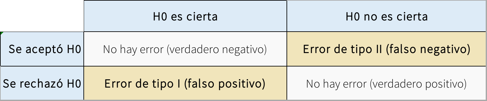
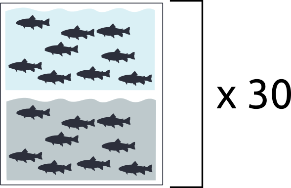

<style>
body
  { counter-reset: source-line 0; }
pre.numberSource code
  { counter-reset: none; }
</style>

&nbsp; 

```{r, echo = FALSE}

# devtools::install_github("hadley/emo")
library("emo")
library("xaringanExtra")
library("knitr")
library(kableExtra)

# options to customize chunk outputs
knitr::opts_chunk$set(
  class.source = "numberLines lineAnchors", # for code line numbers
  tidy.opts = list(width.cutoff = 65), 
  tidy = TRUE,
  message = FALSE
 )

htmltools::tagList(
  xaringanExtra::use_clipboard(
    button_text = "<i class=\"fa fa-clipboard\"></i>",
    success_text = "<i class=\"fa fa-check\" style=\"color: #90BE6D\"></i>",
    error_text = "<i class=\"fa fa-times-circle\" style=\"color: #F94144\"></i>"
  ),
  rmarkdown::html_dependency_font_awesome()
)

# this is a customized printing style data frames 
# screws up tibble function
tibble <- function(x, ...) { 
  x <- kbl(x, digits=4, align= 'c', row.names = FALSE) 
   x <- kable_styling(x, position ="center", full_width = FALSE,  bootstrap_options = c("striped", "hover", "condensed", "responsive")) 
   asis_output(x)
}

registerS3method("knit_print", "data.frame", tibble)
```


## Introducción
En esta clase vamos a hablar de trampas estadísitcas que consciente o inconscientemente podemos cometer en nuestro análisis, generando resultados irreplicables. Nos vamos a enfocar en las consecuencias de estas trampas y cómo evitamos caer en ellas.


<p align="center">
<font size="2">Figura del artículo de [Baker (2016)](https://www.nature.com/news/1-500-scientists-lift-the-lid-on-reproducibility-1.19970). 
</p>

### Error tipo I

Empecemos con un pequeño repaso del (principal) problema que queremos evitar. <span style="color: #32CD32;">Queremos evitar concluir que hay un mecanismo/patrón biológico, cuando en realidad no lo hay</span>

Veamos un ejemplo de la vida real para distinguir error tipo I de error tipo II

<p align="center">
{width=70%}

#### ¿Qué tan común debe ser el error tipo I?

Depende de $\alpha$. Si alpha = 0.05
```{r}
error1 <-
  function(# promedio de x
    m1 = 0,
    # desviacion de x
    sd1 = 1,
    # n de x
    n1 = 1000,
    # promedio de y
    m2 = m1,
    # desviacion de y
    sd2 = sd1,
    # n de y
    n2 = n1,
    # n de simulaciones
    N,
    # alpha
    a = 0.05) {
    
    # Crear un vector para los valores de P
    V <- NULL
    
    for (i in 1:N) {
      # Simular dos variables independientes
      x <- rnorm(n = n1, mean = m1, sd = sd1)
      y <- rnorm(n = n2, mean = m2, sd = sd2)
      
      # x explica y?
      M <- lm(y ~ x)
      S <- summary(M)
      
      # extraer valor de P
      P <- S$coefficients[2, 4]
      
      # agregarlo al vector
      V <- append(x = V, values = P)
    }
    
    # proporcion de resultados significativos
    Err <- length(which(V < a)) / N
    
    # graficar el histograma, marcando el valor de a
    H <- hist(V,
              main = "",
              xlab = "Valor de P",
              ylab = "Frequencia")
    abline(v = a)
    
    cat("Tasa de error tipo 1\n")
    return(Err)
    return(H)
  }

error1(a = 0.05, N = 1000)
```

&nbsp; 

<style>
div.ejercicios { background-color:#F5F5DC; border-radius: 5px; padding: 5px}
div.discu { background-color:#6699CC; border-radius: 5px; padding: 5px}
</style>
<div class = "ejercicios">
### Ejercicio 1

1. Corra la función error1() con dos diferentes valores de alpha
2. Corra la función error1() con dos diferentes valores de N
</div>
&nbsp; 

Ahora veamos algunas cosas que pueden hacer que este supuesto no se cumpla...

## Trampa 1: Comparaciones indirectas

Esta trampa consiste en hacer una interpretación acerca la diferencia entre dos tratamientos o categorías, cuando en realidad lo que hicimos fue investigar cada una por aparte.

Veámoslo en la práctica. La interpretación sería que el efecto de **X** sobre **Y** es diferente entre las categorías **a** y **b**.

```{r}
trampa1 <-
  function(# promedio de x
    m1 = 0,
    # desviacion de x
    sd1 = 1,
    # n de x
    n1 = 1000,
    # promedio del error de y
    m2 = m1,
    # desviacion del error de y
    sd2 = sd1 / 2,
    # efecto de x sobre y, por defecto un valor modesto
    m = 0.05,
    # valor de y cuando x = 0
    t = 0,
    # numero de simulaciones
    N,
    #alpha
    a = 0.05) {
    
    # Crear un vector para los valores de P
    # interacccion treat:X
    V.i <- NULL
    # efecto de x solo en treat = a
    V.a <- NULL
    #efecto de x solo en treat = b
    V.b <- NULL
    
    for (i in 1:N) {
      # simular situacion en que y depende de x
      x <- rnorm(n = n1, mean = m1, sd = sd1)
      y <- t + x * m  + rnorm(n = n1, mean = m2, sd = sd2)
      
      # asignar los valores a los dos tratamientos
      dat <-
        data.frame(treat = rep(c("a", "b"), each = n1 / 2),
                   X = c(x),
                   Y = rep(y))
      
      # el modelo correcto
      M <- lm(Y ~ X * treat, data = dat)
      S <- summary(M)
      
      # los modelos que se hicieron
      dat.a <- dat[1:(n1 / 2), ]
      M.a <-  lm(Y ~ X, dat = dat.a)
      S.a <- summary(M.a)
      
      dat.b <- dat[(n1 / 2 + 1):n1, ]
      M.b <-  lm(Y ~ X, data = dat.b)
      S.b <- summary(M.b)
      
      # extraer valor de P de la interaccion
      P.i <- S$coefficients[4, 4]
      P.a <- S.a$coefficients[2, 4]
      P.b <- S.b$coefficients[2, 4]
      
      # agregarlo al vector
      V.i <- append(x = V.i, values = P.i)
      V.a <- append(x = V.a, values = P.a)
      V.b <- append(x = V.b, values = P.b)
    }
    
    # Cuantos son significativos?
    # error tipo 1 de la interaccion
    Err.i <- length(which(V.i < a)) / N
    
    # proporcion de N en la hay significancia en un solo tratamiento
    Err.t <-
      length(which(V.a < a & V.b >= a | V.a >= a & V.b < a)) / N
    
    Err <-
      data.frame("Tipo" = c("interaccion", "trampa"),
                 "Tasa" = c(Err.i, Err.t))
    cat("Tasas de error \n")
    return(Err)
  }

trampa1(N=1000)
```

<div class = "ejercicios">
### Ejercicio 2

1. Investigue si este error depende del tamaño del efecto de X sobre Y (m)
2. Investigue si este error depende del tamaño de muestra (n1)
3. Investigue si este error depende del error de medición en Y (sd2)
</div>
&nbsp; 

### Yo soy muy inteligente

y no cometería un error así, porque es obvio que hay que incluir la interacción en el modelo. Veamos un caso más complejo y más real.

Por ejemplo, en este diseño experimental, estamos viendo el efecto de contaminación (Ct), y competencia (Cp) en una respuesta fisiológica al estrés (R) y en tres especies de pecesitos (E).


&nbsp; 

<div class = "ejercicios">

### Ejercicio 3

1. En este caso, lo correcto es hacer R ~ Ct * Cp para cada especie, o R ~ Ct * Cp * E?
2. Si su modelo es R ~ Ct * Cp * E, y la interacción Ct:Cp:E es significativa, cómo la interpreta? 
</div>
&nbsp; 

## Trampa 2: Inflación de N
Sigamos con el estudio del ejercicio anterior, pero por ahora vamos a asumir que sólo hay una especie y una densidad:



Tenemos 30 tanques por tratamiento pcada uno con 9 peces, es decir 270 peces por tratamiento cada uno con una medida de estrés (E) asociada.

¿Cuál es la <span style="color: #32CD32;"> **unidad de  muestreo**</span> en este estudio?

¿Cuáles unidades podrían considerarse <span style="color: #32CD32;"> **independientes**</span> entre sí?

Veamos que pasa si pensamos que los peces son unidades de muestreo independientes. Vamos a simular una situación en la que la contaminación aumenta el estrés pero el efecto es modualdo por condiciones específicas en cada tanque.

```{r, message=FALSE}
require(ggplot2)
require(lme4)
trampa2 <- function(# efecto promedio de Ct
  m1 = 1,
  # desviacion de Ct
  sd1 = 1,
  # n de peces por tanque
  n1 = 9,
  # n de tanques
  n2 = 30,
  # efecto promedio de los tanques (Tnq)
  m2 = 0,
  # desviacion de Tnq -> indica cuánto se diferencian los tanques entre sí
  sd2 = 1,
  # promedio del error de E
  m3 = 0,
  # desviacion del error de E -> indica la variación entre peces que no se debe al tanque
  sd3 = sd2 / 2,
  # valor de E cuando Ct = 0
  t0 = 0,
  # numero de simulaciones
  N,
  #alpha
  a = 0.05) {
  # crear vectores para guardar los resutados
  # efecto estimado en 3 modelos
  V.m1 <- NULL
  V.m2 <- NULL
  V.m3 <- NULL
  
  # error estandar del efecto en 3 modelos
  V.s1 <- NULL
  V.s2 <- NULL
  V.s3 <- NULL
  
  # simulemos
  for (i in 1:N) {
    # un mismo efecto para todos los peces en un tanque
    Tnq.0 <- rep(rnorm(n = n2 , mean = m2, sd = sd2), each = n1)
    # Sin Ct E depende solo del tanque y el pez
    E.0 <- t0 + Tnq.0 + rnorm(n = n1 * n2 ,
                              mean = m3,
                              sd = sd3)
    
    # efecto de las contaminacion
    Ct <- rnorm(n = n2 * n1,
                mean = m1,
                sd = sd1)
    # un mismo efecto adicional para todos los peces en un tanque
    Tnq.1 <- rep(rnorm(n = n2 , mean = m2, sd = sd2), each = n1)
    # estres depende del pez, el tanque y la contaminacion
    E.1 <- t0 +  Ct + Tnq.1 + rnorm(n = n1 * n2 ,
                                    mean = m3,
                                    sd = sd3)
    # juntamos todo
    dat1 <- data.frame(
      treat = rep(c("0" , "1"), each = n1 * n2),
      E = c(E.0, E.1),
      Tnq = rep(seq(1:(n2 * 2)), each = n1)
    )
    # modelo con peces como unidades de muestreo
    M.1 <- lm(E ~ treat, data = dat1)
    S.1 <- summary(M.1)
    
    # y si sacamos el promedio del nivel de estres por tanque
    dat2 <- aggregate(dat1$E,
                      by = list (dat1$treat, dat1$Tnq),
                      FUN = mean)
    colnames(dat2) <- c("treat", "Tnq", "E")
    
    # modelo con tanques como unidades de muestreo
    M.2 <- lm(E ~ treat, data = dat2)
    S.2 <- summary(M.2)
    
    # modelo mixto
    M.3 <- lmer(E ~ treat + (1|Tnq), data = dat1)
    S.3 <- summary(M.3)
    
    # guardamos efectos y errores estandar en los vectores
    V.m1 <- append(V.m1, S.1$coefficients[2, 1])
    V.s1 <- append(V.s1, S.1$coefficients[2, 2])
    
    V.m2 <- append(V.m2, S.2$coefficients[2, 1])
    V.s2 <- append(V.s2, S.2$coefficients[2, 2])
    
    V.m3 <- append(V.m3, S.3$coefficients[2, 1])
    V.s3 <- append(V.s3, S.3$coefficients[2, 2])
  }
  
  # juntamos todo todo
  err.df <-
    data.frame(
      modelo = rep(rep(
        c("n.total", "n.tanques", "mixto"), each = N
      ), 2),
      valor = c(V.m1, V.m2, V.m3, V.s1, V.s2, V.s3),
      par = rep(c("promedio", "se"), each = N * 3)
    )
  
  # graficamos los histogramas de cada modelo para el efecto y el error
  p <-
    ggplot(data = err.df, aes(x = valor, colour = modelo, fill = modelo)) + geom_histogram(
      bins = 50,
      position = "stack",
      alpha = 0.5,
      lwd = 0.2
    ) +
    theme_minimal(base_size = 16) + facet_wrap(~ par, scales = "free") +
    scale_colour_manual(values = c("#BDB76B", "#32CD32", "#00416A")) +
    scale_fill_manual(values = c("#BDB76B", "#32CD32", "#00416A"))
  return(p)
}

trampa2(m1 = 1, sd2 = 2, sd3 = 1, N = 1000)
```

<div class = "ejercicios">

### Ejercicio 4

1. ¿Cuál es la consecuencia de aumentar sd2? ¿Por qué?
2. ¿Cuáles son los grados de libertad en el modelo 1 y en el modelos 2?
</div>
&nbsp;

## Trampa 3: Tamaño de muestra pequeño

En biología nos formamos pensando que un tamaño de muestra prqueño no es deseable. Pero ¿por qué? Tal vez tenemos la intuición de que el poder estadístico (la capacidad de detectar un efecto cuando el efecto existe) está relacionadon con nuestro tamaño de muestra. Hasta ahí vamos bien.

Tal vez también sabemos que un mayor tamaño de muestra nos ayuda a obtener estimados más precisos. Y si comobinamos estas dos afirmaciones podemos concluir que <span style="color: #32CD32;">si un efecto es pequeño (i.e. cercano a 0) vamos a necesitar un mayor tamaño de muestra para poder deterctarlo.</span>

Creo que hasta aquí seguimos bien. El problema es que a veces derivamos una conclusión más, que sería algo así:

*Esto quiere decir que si yo ya detecté un efecto con un tamaño de muestra pequeño, el efecto real debe ser grande, ya que si hubiera sido pequeño no lo hubiera podido detectar*

Este razonamiento nos llevaría a no desconfiar de un resultado significativo obtenido con un tamaño de muestra pequeño y tal vez nos llevaría incluso a creer todavía más en la importancia de este efecto.

¡Veamos el problema!

```{r}
trampa3 <-
  function(
    # promedio de x
    m1 = 0,
    # desviacion de x
    sd1 = 1,
    # promedio de y
    m2 = m1,
    # desviacion de y
    sd2 = sd1,
     # n de muestra pequenia
    np = 10,
    # n de de muestra grande 
    ng = 30,
    # n de simulaciones
    N,
    # alpha
    a = 0.05) {
    # Crear vectores para los valores de P, R y beta
    V.P  <- NULL
    V.R <- NULL
    V.b <- NULL
    
    # n pequenio
    for (i in 1:N) {
      
      # Simulamos dos variables independientes
      x.p <- rnorm(n = np, mean = m1, sd = sd1)
      y.p <- rnorm(n = np, mean = m2, sd = sd2)
      
      # x explica y?
      M.p <- lm(y.p ~ x.p)
      S.p <- summary(M.p)
      
      # extraemos valor de P
      P.p <- S.p$coefficients[2, 4]
      
      # extraemos R
      R.p <- S.p$adj.r.squared
      
      # extraemos pendiente
      beta.p <- S.p$coefficients[2, 2]
      
      # agregamos los valores a los vectores correspondientes
      V.P <- append(x = V.P, values = P.p)
      V.R <- append(x = V.R, values = R.p)
      V.b <- append(x = V.b, values = beta.p)
    }
    
    # n grande
    for (i in 1:N) {
      
      # Simulamos dos variables independientes
      x.g <- rnorm(n = ng, mean = m1, sd = sd1)
      y.g <- rnorm(n = ng, mean = m2, sd = sd2)
      
      # x explica y?
      M.g <- lm(y.g ~ x.g)
      S.g <- summary(M.g)
      
      # extraemos valor de P
      P.g <- S.g$coefficients[2, 4]
      
      # extraemos R
      R.g <- S.g$adj.r.squared
      
      # extraemos pendiente
      beta.g <- S.g$coefficients[2, 2]
      
      # aagregamos los valores a los vectores correspondientes
      V.P <- append(x = V.P, values = P.g)
      V.R <- append(x = V.R, values = R.g)
      V.b <- append(x = V.b, values = beta.g)
    }
    
    # juntamos todo
    dat <-
      data.frame(
        n = rep(c("pq", "gd"), each = N),
        P = V.P,
        R = V.R,
        beta = V.b
      )
    
    # proporcion de resultados significativos
    Err.p <- length(which(dat$n == "pq" & dat$P < a)) / N
    Err.g <- length(which(dat$n == "gd" & dat$P < a)) / N
    
    # R promedio de falsos positivos
    R.p <- mean(dat$R[which(dat$n == "pq" & dat$P < a)])
    R.g <- mean(dat$R[which(dat$n == "gd" & dat$P < a)])
    
    # beta promedio de falsos positivos
    b.p <- mean(dat$beta[which(dat$n == "pq" & dat$P < a)])
    b.g <- mean(dat$beta[which(dat$n == "gd" & dat$P < a)])
    
    # cuadro para imprimir
    err.df <-
      data.frame(
        par = c("error.1", "R.promedio", "beta.promedio"),
        pq = c(Err.p, R.p, b.p),
        gd = c(Err.g, R.g, b.g)
      )
    
    # agreguemos una columna indicando si la prueba es significativa
    for (i in 1:(2 * N)) {
      ifelse(dat$P[i] >= a, dat$S[i] <-
               "N.S.", dat$S[i] <- "Significativo")
    }
    
    # graficamos los histogramas de R para cada tamanio de muestra y en pruebas N.S. o significativas
    p <-
      ggplot(data = dat, aes(x = R, colour = n, fill = n)) + geom_histogram(
        bins = 50,
        position = "identity",
        alpha = 0.5,
        lwd = 0.2
      ) +
      theme_minimal(base_size = 16) + facet_wrap( ~ S, scales = "free") +
      scale_colour_manual(values = c("#BDB76B", "#32CD32")) +
      scale_fill_manual(values = c("#BDB76B", "#32CD32"))
    p
    
    # resultado
    cat("Comparacion entre tamanios de muestra\n")
    out <- list(err.df, p)
    return(out)
    
  }

trampa3(N = 1000)
```

#### Moraleja

Los falsos postivos con tamaños de muestra pequeños típicamente son efectos grandes.

<div class = "ejercicios">

### Ejercicio 5

1. ¿Qué pasa si aumenta el tamaño de muestra grande a 100? ¿Por qué?
2. ¿Qué esperaría con respecto a la distribución de valores de R si el tamaño de muestra fuera infinito?
</div>
&nbsp;

<div class = "discu">
### Discusión

¿Y entonces cuál es un tamaño de muestra apropiado?

</div>
&nbsp;

## Trampa 4: Comparaciones múltiples

<p align="center">
{width=50%}
</p>

Comic: Randall Munroe, [xkcd.com](https://xkcd.com/) / CC BY-NC (https://creativecommons.org/licenses/by-nc/2.5/)

Al inicio de la clase vimos que alpha representa la probabilidad de un efecto espúreo, es decir, un efecto que detectamos estadísticamente aún cuando las variables son independientes. La idea aquí es que cuando hacemos más pruebas con una <span style="color: #32CD32;">misma variable o variables del mismo set de datos </span> la probabilidad de que al menos una sea espúrea aumenta.

Veamos cómo.
```{r}
trampa4 <-
  function(# promedio de x
    m1 = 0,
    # desviacion de x
    sd1 = 1,
    # tamaño de muestra
    n1 = 100,
    # numero de pruebas
    ntest = 5,
    # n de simulaciones
    N,
    # alpha
    a = 0.05) {
    # crear un vector para la siginficancia de la prueba
    V.P  <- NULL
    
    # simulemos
    for (i in 1:N) {
      # variable de respuesta
      y <- rnorm(n = n1, mean = m1, sd = sd1)
      
      # vector para los valores de p
      V.p <- NULL
      
      # un analisis con cada predictor
      for (j in 1:ntest) {
        M <-  lm (y ~ rnorm(n = n1, mean = m1, sd = sd1))
        S <- summary(M)
        V.p <- append(x = V.p, values = S$coefficients[2, 4])
      }
      
      # registremos si hay al menos un resultado significativo
      ifelse(test = any(V.p < a),
             yes = V.P[i] <- 1,
             no = V.P[i] <- 0)
    }
    
    # errir tipo 1 con n comparaciones
    err <- length(which(V.P == 1)) / N
    
    cat("Tasa de error tipo 1\n")
    return(err)
  }
      
trampa4(ntest = 20, N = 1000)
```

<div class = "ejercicios">

### Ejercicio 6

1. ¿Qué pasa si aumenta el número de tests realizados? ¿Por qué?
2. ¿Qué pasa si reduce el valor de alpha? ¿Por qué?
</div>
&nbsp;

### Dos preguntas sobresalientes

Rara vez colectamos un set de datos completo para hacer un único modelo estadístico. Si esta es su realidad ud. tiene al menos dos preguntas.

#### ¿Cómo puedo corregir este error?

Existen en realidad varias maneras de lidear con este error y hace unos años la discusión de cómo hacerlo era intensa. Primero, si el estudio es del tipo de "prueba de hipótesis" podría limitarse mucho el error haciendo un número razonable (pequeño) de análisis que respondan la pregunta sin probar todo contra todo.

Si el análisis es más exploratorio o por alguna razón se requiren muchas pruebas (e.g. análsis de expresión genética diferencial en los que hay tantas pruebas como genes). necesitamos algún método para corregir por esta inflación del error.

La literatura es extensa y aquí no vamos a entrar en detalles. Sólo quiero hablar de lo básico. Uno de los primeros métodos es la [corrección de Boferroni](https://link.springer.com/referenceworkentry/10.1007%2F978-1-4419-9863-7_1213). Esta corrección consiste en simplemente dividir alpha entre el número de pruebas y es <span style="color: #32CD32;">abrumadoramente conservadora</span>. Con esto me refiero a que hace que el [error tipo II se dispare](https://academic.oup.com/beheco/article/15/6/1044/206216). 

Otro problema es que la corrección de Bonferroni [no reconoce el número de comparaciones significativas](https://www.jstor.org/stable/3548200?seq=1#metadata_info_tab_contents). Bonferroni no distingue entre la probabilidad de que al menos una de n comparaciones sea espúrea vs. la probabilidad de que dos o tres o cuatro de las n comparaciones sean simultáneamente espúreas. Los últimos tres escenarios son cada uno menos probable que el anterior.

Dados estos problemas (entre otros) y la existencia de métodos más apropiados, como por ejemplo la [tasa de descubrimientos falsos de Benjamini-Hochberg](https://rss.onlinelibrary.wiley.com/doi/abs/10.1111/j.2517-6161.1995.tb02031.x) y la alternativa de [enfocarnos en tamaños de efecto en lugar de valores de P](https://academic.oup.com/beheco/article/17/4/682/215700), es más que suficiente para enterrar a Bonferroni.

#### ¿Qué es "un mismo set de datos"?

Si nos preocupa inflar el error tipo I al hacer muchas comparaciones con el mismo set de datos. No es trivial preguntarse ¿qué es un mismo set de data? ¿serán todos los datos usados en un mismo artículo? ¿todos los datos colectados en un mismo proyecto (que produce n artículos)? ¿Todos los datos colectados en una misma población de estudio o en un mismo laboratorio?  

## Trampa 5: Reporte selectivo

Esta trampa consiste en correr una serie de análisis, pero mencionar sólo los análisis que dieron resultados significativos, como si los demás análisis nunca se nos hubieran ocurrido. En una forma extrema, esta trampa implica modificar y repetir algún análisis <span style="color: #32CD32;">hasta que sea significativo </span>(p-hacking).

<p align="center">
{width=50%}
</p>

Ahora, todxs sabemos que esto es un <span style="color: #32CD32;">**no no**</span>, pero ¿por qué? ¿Cuál es el problema realmente de reportar sólo los análisis que dieron significativos?

Veamos cómo esta trampa se relaciona con la anterior.

```{r}
trampa5 <-
  function(
    # promedio de x
    m1 = 0,
    # desviacion de x
    sd1 = 1,
    # tamaño de muestra
    n1 = 100,
    # n de simulaciones
    N,
    # alpha
    a = 0.05) {
    # Crear vectores para los valores de P, R y beta
    V.E  <- NULL
    
    # simulemos
    for (i in 1:N) {
      # variable de respuesta
      y <- rnorm(n = n1, mean = m1, sd = sd1)
      #vector con para guardar valores de P
      V.P <- NULL
      j <- 1
      
      # hagamos pruebas con predictores independientes, hasta que alguno de significativo
      repeat {
        M <-  lm (y ~ rnorm(n = n1, mean = m1, sd = sd1))
        S <- summary(M)
        V.P <- append(x = V.P, values = S$coefficients[2, 4])
        if (V.P[j] >= a){
                j <- j +1} else {break}
      }
    len.P <- length(V.P)  
     V.E <- append (x = V.E, values = len.P)  
    }
  
  # grafiquemos el histograma
   hist(V.E,
              main = "",
              xlab = "Número de pruebas para llegar a p < 0.05",
              ylab = "Frequencia")
}
      
trampa5(N = 1000)

```

Al hacer p-hacking estamos inflando el error tipo 1 porque <span style="color: #32CD32;">hay más pruebas sobre la(s) misma(s) variable(s) de respuesta que las que estamos reportando.</span>

<div class = "ejercicios">

### Ejercicio 7

1. ¿Qué otras maneras de hacer p-hacking existen?
2. ¿Cómo podemos hacer para evitarlas?
</div>
&nbsp;

## Trampa 6: Especificación del modelo

<p align="center">
{width=50%}
</p>

Comic: Randall Munroe, [xkcd.com](https://xkcd.com/) / CC BY-NC (https://creativecommons.org/licenses/by-nc/2.5/)

Aún si tomamos todas las precauciones para evitar las trampas anteriores, nuestras inferencias pueden ser salvajemente incorrectas si nuestro modelo es una representación muy pobre de la realidad. Con esto hay que decir que todos los modelos son representaciones incompletas de la realidad. Esa es la idea. Un modelo es útil si podemos simplificar la realidad y aún así descubrir algo verdadero sobre la la naturaleza. Para citar a Goerge E. P. Box <span style="color: #32CD32;">"todos los modelos son esencialmente incorrectos, pero algunos son útiles."</span>

La pregunta más difícil es por supuesto, qué tan incorrecto tiene que ser un modelo para dejar de ser útil. Una pregunta más a nuestro alcance por ahora es por qué es importante evitar un modelo muy incorrecto, cuando hay otro modelo menos incorrecto disponible. Por supuesto, las maneras en que un modelo puede ser incorrecto son infinitas. Entonces aquí vamos a ver sólo un ejemplo.

Nos vamos a enfocar en situaciones en las que érroneamente asumimos una distribución normal en los errores. Recordemos que errores son simplemente las desviaciones entre valores observados y un estimado (como un promedio o una línea de ajuste). Digamos que colectamos datos sobre el número de parásitos en una población de peces. En la vida real es común que muchos peces tengan cero o pocos parásitos, ya que han evolucionado adptaciones para resistirlos, mientras que algunos pocos individuos (tal vez los que ya estaban en una mala condición) tienen muchos parásitos.

Aquí queremos investigar si el número de parásitos aumenta con la temperatura del agua. Asumamos que la mayoría de los lagos tienen una temperatura intermedia, algunos son relativamente fríos y todavía menos son muy fríos. Igual con las temperaturas calientes, cuánto más caliente menos común. Veamos.

```{r, message=FALSE}
require(gridExtra)
  require(DAAG)

trampa6 <- function(
  # intercepto
  a = 0,
  # coeficiente lineal
  b = 2,
  # tamanio de muestra
  n = 50,
  # valor en x para la prediccion
  P = 0.5,
  # numero de simulaciones
  N = 1000) {
  
  # vectores para deviance
  V.D1 <- NULL
  V.D2 <- NULL
  
  # vectores para valores predichos
  V.P1 <- NULL
  V.P2 <- NULL
  
  # simulemos
  for (i in 1:N) {
    # x puede tomar cualquier valor entre 0 y 1
    x <- runif(n = n, min = 0, max = 1)
    # usamos una funcion del paquete DAAG para simular la respuesta de acuerdo con Poisson 
    dat <- poissonsim(x = x, a = a, b = b)
    
    # ahora analizamos los resultados como si los errores fueran normales
    M.1 <- glm(y ~ x, family = "gaussian", data = dat)
    S.1 <- summary.glm(M.1)
    
    # deviance del modelo con el predictor
    V.D1 <- append (x = V.D1, values = S.1$deviance)
    
    # numero de parasitos esperados cuando x = P
    P1 <-
      predict.glm(object = M.1,
                  newdata = data.frame(x = P),
                  type = "response")
    V.P1 <- append (x = V.P1, values = P1)
    
    # ahora analizamos con la estructura de error que corresponde
    M.2 <- glm(y ~ x, family = "poisson", data = dat)
    S.2 <- summary(M.2)
    
    # deviance del modelo con el predictor
    V.D2 <- append (x = V.D2, values = S.2$deviance)
    
    # numero de parasitos esperados cuando x = P
    P2 <-
      predict.glm(object = M.2,
                  newdata = data.frame(x = P),
                  type = "response")
    V.P2 <- append (x = V.P2, values = P2)
  }
  
  # juntamos todo
  err.df <-
    data.frame(
      modelo = rep(c("normal", "poisson"), each = N),
      Deviance = c(V.D1, V.D2),
      Prediction = c(V.P1, V.P2)
    )
 
  #graficamos los datos en la escala original
  p1 <-
    ggplot(data = dat, aes(x = x, y = y)) + geom_point(size = 3,
                                                       color =  "#32CD32",
                                                       alpha = 0.5) +
    theme_minimal(base_size = 16)
  
  # graficamos los histogramas de cada modelo para "deviance" y los valores predichos
  p2 <-
    ggplot(data = err.df, aes(x = Deviance, colour = modelo, fill = modelo)) + geom_histogram(
      bins = 50,
      position = "identity",
      alpha = 0.5,
      lwd = 0.2
    ) +
    theme_minimal(base_size = 16) +
    scale_colour_manual(values = c("#BDB76B", "#32CD32")) +
    scale_fill_manual(values = c("#BDB76B", "#32CD32")) +
    geom_vline(
      xintercept = n - 2,
      size = 1,
      lty = 2,
      colour = "grey20"
    )
  
  p3 <-
    ggplot(data = err.df, aes(x = Prediction, colour = modelo, fill = modelo)) + geom_histogram(
      bins = 50,
      position = "identity",
      alpha = 0.5,
      lwd = 0.2
    ) +
    theme_minimal(base_size = 16) +
    scale_colour_manual(values = c("#BDB76B", "#32CD32")) +
    scale_fill_manual(values = c("#BDB76B", "#32CD32")) +
    xlab("Predicción para x = P")
  
  grid.arrange(p1, p2, p3, ncol = 1)
}

trampa6(N = 1000, b = 5)

```

<div class = "ejercicios">

### Ejercicio 8

1. ¿Qué pasa al aumentar b? ¿Por qúe?
2. ¿Qué pasa cuando b = 0? ¿Por qué?
</div>
&nbsp;

#### Moraleja
Tres preguntas de que preocuparse son:

1. ¿Cuáles son los supuestos que hace mi análisis?

2. ¿Qué razones tengo para creer que mis datos no violan esos supuestos?

3. ¿Qué tan robusto es el modelo a la violación de distintos supuestos?

```{r}
sessionInfo()
```

